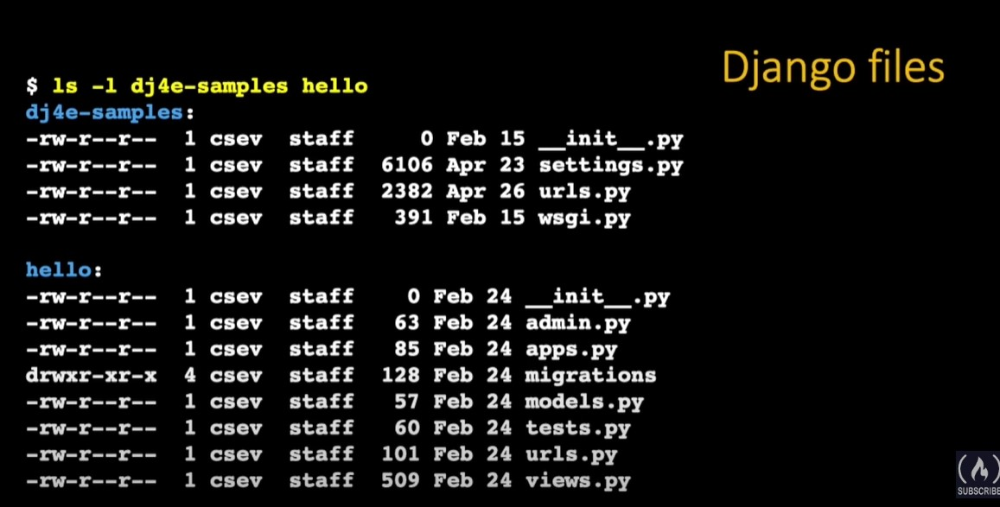
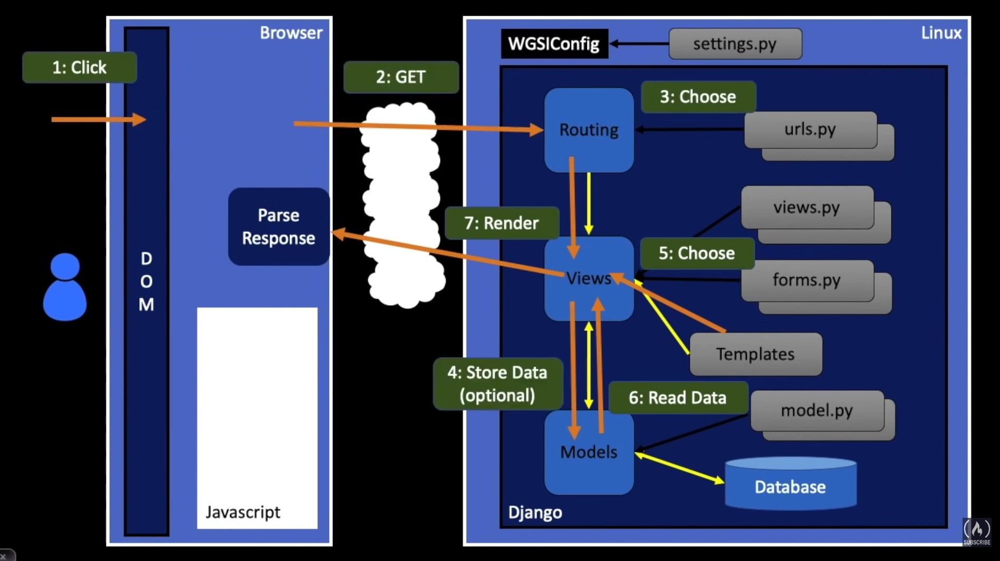

# Structure of Django Proyects

## Index

- [Structure of Django Proyects](#structure-of-django-proyects)
  - [Index](#index)
  - [Introduction](#introduction)
  - [Django Terminology](#django-terminology)
  - [Structure of the project](#structure-of-the-project)
  - [Flow of a web request](#flow-of-a-web-request)
  - [Virtual hosting](#virtual-hosting)

## Introduction

Django as any web framework as some way to do the things. Take a lot of convention to organize the data, dir structures and file. This is because Django is thought to be reusable organize the main operation in app and the all the web page as a **Project**. A developed app to serve in one project can be used in another project to save time and complexity.

## Django Terminology

* `Project` is a collection of applications
  * Our project is "dj4e-samples" (the project of the course)
  * Project wide configuration in dj4e is in *dj4e-samples/dj4e-sample*

* The first application is called "hello"
  * Almost all the web development will be in the application folder *dj4e-samples/hello*

[https://samples.dj4e.com/](https://samples.dj4e.com/)
[https://github.com/csev/dj4e-samples](https://github.com/csev/dj4e-samples)

## Structure of the project

The structure of a Django Project focused to our course is the following:  
* The main package name (dj4e-samples)
  * **DIR** Package configuration (dj4e-samples) **Note** It has the same name that project folder
  * **DIR** Application folder (hello)

The files involved in this are:

## Flow of a web request

1. When the request arrives to Django app the incoming request URL is compared to the list of paths in `url.py` in the variable urlpatterns.
2. When there is a math, it selects a "**View**" which is a bit of code that handles any database access and then produces and delivers the response to the browser.
   * The view access the database indirectly through an abstraction called "**Model**".

This is a general web pattern called "**Model-View-Controller**" or **MVC**.

In the previous image the request is send by the browser then:
1. The route is compared in the file `urls.py`. Inside this script exists a variable with all the routes pre configured if route doesn't is not matched return an error (404). If is matched then goes to the `view`.
2. The view manage various files to organze how the response will be. If is neccesary the view will conect to the `model` to fetch information from database.
3. Finally the view send the response back to the browser.

## Virtual hosting

Virtual hosting is when a system can manage multiple domains in one system.

* HTTP Hypertext Transport Protocol
* Connects to a domain
* **Includes the domain in the GET request**

