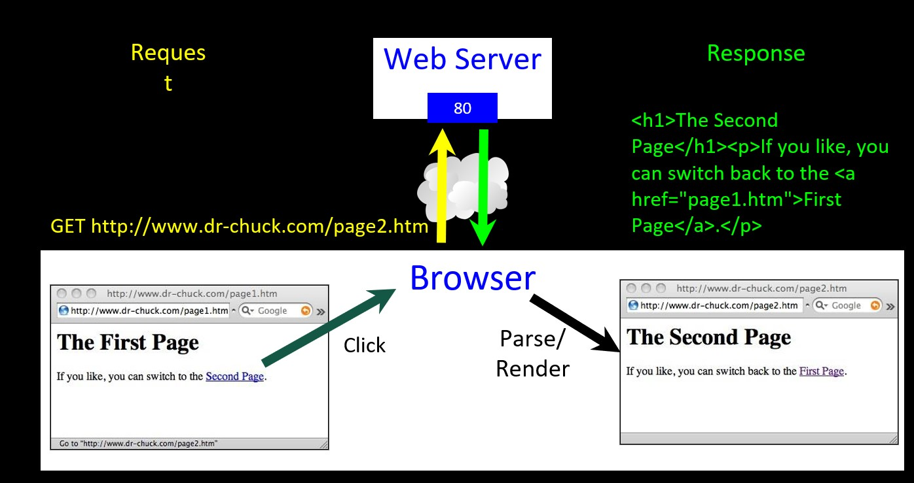
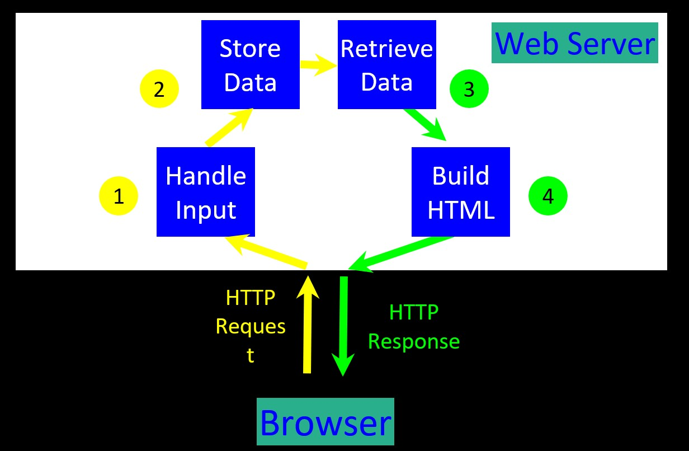
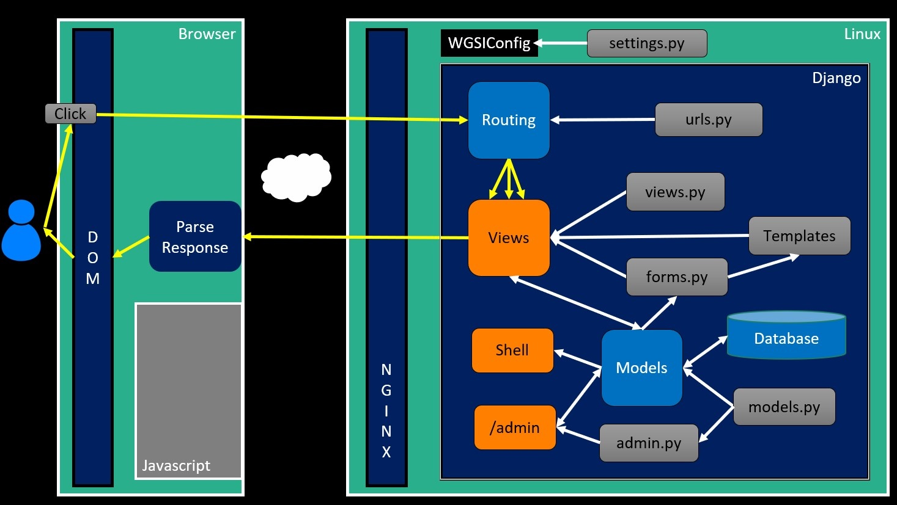

# MVC (model view controller)

> "In MVC, the **model** represents the information (the data) of the application and the business rules used to manipulate the data; the **view** corresponds to elements of the user interface such as text, checkbox items, and so forth; and the **controller** manages details involving the communication to the model of user actions." wikipedia

We name the three basic functions of an application as follows
* Controller - The code that does the thinking and decision making
* View - The HTML, CSS, etc. which makes up the look and feel of the application
* Model - The persistent data that we keep in the data store

Sometime is difficult to say where is the controller becuase the controller is divided in too many parts through the application.

## Taks inside the server

* Process any user input data (i.e. from a form) - possibly storing it in a database or making some other change to the database such as a delete
* Decide which screen to send back to the user
* Retrieve any needed data
* Produce the HTML response and send it back to the browser (i.e. a template)

Our Django app follow this architecture. The route part is the controller to chose what route follow to 

The routing is the controller when request an url decide where to go. The view is something part controller can make a redirect by its own.

