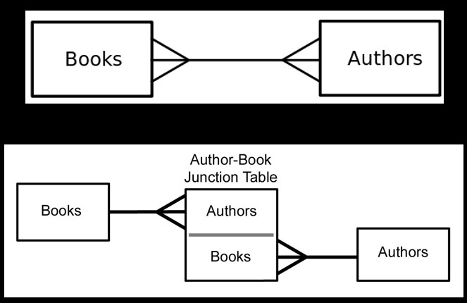

# Index

- [Index](#index)
- [Many to many](#many-to-many)
  - [An example more complicated](#an-example-more-complicated)
- [Using a script to read data](#using-a-script-to-read-data)
  - [The data and example of use](#the-data-and-example-of-use)
  - [Run the script](#run-the-script)
  - [See the thorugh table](#see-the-thorugh-table)

# Many to many

In the context of many to many is not possible to have that kind of relation because you are violating the property of relational databases. For that reason we cheat in some way to have that kind of relation. Even when an application offers you the option of many-to-many ralation is facked behind the play.

To do this we made a intermedite table this is usually named as 'join table', 'through table', 'relation table', etc. The table cosist in two foreight columns to simulate a many-to-many relation.

> * Sometimes we need to model a relationship that is many to many.
> * We need to add a “connection” table with two foreign keys.
> * There is usually no separate primary key.
> * We need two one-to-many relationships to capture a many-to-many




The code looks like these ones:

```python
# https://github.com/csev/dj4e-samples/blob/master/samples/bookmany/models.py

from django.db import models

class Book(models.Model):
    title = models.CharField(max_length=200)
    authors = models.ManyToManyField('Author', through='Authored')

class Author(models.Model):
    name = models.CharField(max_length=200)
    books = models.ManyToManyField('Book', through='Authored')

class Authored(models.Model):
    book = models.ForeignKey(Book, on_delete=models.CASCADE)
    author = models.ForeignKey(Author, on_delete=models.CASCADE)

```

Remember ofter save this you need to run makemigrations and migrations commands.

The exaple in the shell look like this:

```shell
dj4e-samples$ python3 manage.py shell
>>> from bookmany.models import Book, Author, Authored
>>> b1 = Book(title='Networking')
>>> b1.save()
>>> b2 = Book(title='Raspberry')
>>> b2.save()
>>> a1 = Author(name='Fontichiaro')
>>> a1.save()
>>> a2 = Author(name='Severance')
>>> a2.save()
>>> Authored(book=b1, author=a2).save()
>>> Authored(book=b2, author=a1).save()
>>> Authored(book=b2, author=a2).save()
>>> b1.authors.values()
<QuerySet [{'id': 2, 'name': 'Severance'}]>
>>> b2.author_set.values()
<QuerySet [{'id': 1, 'name': 'Fontichiaro'}, {'id': 2, 'name': 'Severance'}]>
>>> a1.books.values()
<QuerySet [{'id': 2, 'title': 'Raspberry'}]>
>>> a2.book_set.values()
<QuerySet [{'id': 1, 'title': 'Networking'}, {'id': 2, 'title': 'Raspberry'}]>
>>> quit()
dj4e-samples$ 
```

## An example more complicated

The example more complicated can be see as like a course table. When you need to know what courses are taking the students and what what student are in one course. And even the relation can have an attribute like type of relation (student, professor, administrator, etc.).


```python
from django.db import models
  
class Person(models.Model):
    email = models.CharField(max_length=128, unique=True)
    name = models.CharField(max_length=128, null=True)

class Course(models.Model):
    title = models.CharField(max_length=128, unique=True)
    members = models.ManyToManyField(Person, 
            through='Membership', related_name='courses')

class Membership(models.Model):
    person = models.ForeignKey(Person, on_delete=models.CASCADE)
    course = models.ForeignKey(Course, on_delete=models.CASCADE)

    LEARNER = 1
    IA = 1000
    GSI = 2000
    INSTRUCTOR = 5000
    ADMIN = 10000

    MEMBER_CHOICES = (
        ( LEARNER, 'Learner'),
        ( IA, 'Instructional Assistant' ),
        ( GSI, 'Grad Student Instructor' ),
        ( INSTRUCTOR, 'Instructor' ),
        ( ADMIN, 'Administrator' ),
    )

    role = models.IntegerField(
        choices=MEMBER_CHOICES,
        default=LEARNER,
    )


```

# Using a script to read data

To use a script to load data to our model we need first to enable the use of external scripts.

We can do this dowload a module to django enviroment and changing the setting file like this:

```python
# dj4e-samples/settings.py

INSTALLED_APPS = [
    'django.contrib.admin',
    'django.contrib.auth',

[ ... ]

    # Extensions - see requirements.txt
    'django_extensions', # <- here need to add this option
    'crispy_forms',

[ ... ]

    'home.apps.HomeConfig',

    # Sample Applications - don't copy
    'hello.apps.HelloConfig',
    'getpost.apps.GetpostConfig',
    'users.apps.UsersConfig',

[ ... ]
]
```

Then we need to put the script in the next path:

```shell
dj4e-samples$ mkdir scripts
dj4e-samples$ touch scripts/__init__.py
```

## The data and example of use

The data is from [wikepedia](https://en.wikipedia.org/wiki/Cat_(Unix)) and we will loaded to our data following our previos model in the last secction.

```shell
dj4e-samples$ cat many/load.csv 
jane@tsugi.org,I,Python
ed@tsugi.org,L,Python
sue@tsugi.org,L,Python
ed@tsugi.org,I,Django
sue@tsugi.org,L,Django
ed@tsugi.org,I,SQL
jane@tsugi.org,L,SQL
dj4e-samples$
```

The script only reads the data from a csv file and then go save this in the database. Note the use of the `get_or_create` method to avoid duplicate the data.

```python
# scripts/many_load.py

import csv  # https://docs.python.org/3/library/csv.html

from many.models import Person, Course, Membership

def run():
    fhand = open('many/load.csv')
    reader = csv.reader(fhand)

    Person.objects.all().delete()
    Course.objects.all().delete()
    Membership.objects.all().delete()

    for row in reader:
        print(row)

        p, created = Person.objects.get_or_create(email=row[0])
        c, created = Course.objects.get_or_create(title=row[2])

        r = Membership.LEARNER
        if row[1] == 'I' : r = Membership.INSTRUCTOR
        m = Membership(role=r,person=p, course=c)
        m.save()

```

## Run the script

Runing the model is easy and can be done through the shell. Lets to see this using the previos example:

```shell
dj4e-samples$ python3 manage.py runscript many_load
['jane@tsugi.org', 'I', 'Python']
['ed@tsugi.org', 'L', 'Python']
['sue@tsugi.org', 'L', 'Python']
['ed@tsugi.org', 'I', 'Django']
['sue@tsugi.org', 'L', 'Django']
['ed@tsugi.org', 'I', 'SQL']
['jane@tsugi.org', 'L', 'SQL']
dj4e-samples$

```

## See the thorugh table

to see the information in the through table is done with the next code (the code was obtained form stack overflow)

```shell
>>> y = Course.objects.get(pk=2)
>>> y.membership_set.all().values()
<QuerySet [
{'id': 4, 'person_id': 2, 'course_id': 2, 'role': 5000},
{'id': 5, 'person_id': 3, 'course_id': 2, 'role': 1}
]>
>>> 

```

[stackoverflow](https://stackoverflow.com/questions/2005953access-fields-in-django-intermediate-model)
