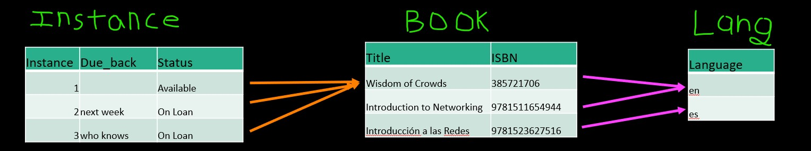

# Indice

- [Indice](#indice)
- [One To Many Database](#one-to-many-database)
- [How to build a models](#how-to-build-a-models)
- [makemigrations and migration](#makemigrations-and-migration)
  - [on_delete](#on_delete)
  - [How the data looks like in the database](#how-the-data-looks-like-in-the-database)

# One To Many Database

One important thing about databases is normalize data. There are many concep related to this but the most import is not replicate text data. Because can consume too much space. The idea is to only save one time stings like email, names, etc. after only use a number reference to them when is necesary a relation with these data.


* There is *tons* of database theory / math – we simplify this to a few rules…
* Do not replicate data - reference data - point at data
* Add a special “unique key” column to each table which we will make references to.   By convention, many programmers and frameworks call this column “id”
* Use integers for to make links between tables – integers are fast and small

how to decide when to use this:

* Drawing a picture of the data objects for our application and then figuring out how to represent the objects and their relationships
* Basic Rule: Don’t put the same string data in twice - use a relationship instead
* When there is one thing in the “real world” there should only be one copy of that thing in the database

Legend:
1     One
1..*  Many with a minimum of 1
0..*  Many with a minimum of 0

# How to build a models
In this section we will build a database with DJango. The implementation is based in books analogy.There are 3 tables `Lang` with the language books, `Book` an entry for every book (not reapeted) and `Instance` for represent the multiple copies of one book.

The representacion of the books looks like this:



The implementation in python and django looks like this:

```python

from django.db import models
  
class Lang(models.Model):
    name = models.CharField(max_length=200)

class Book(models.Model):
    title = models.CharField(max_length=200)
    isbn = models.CharField(max_length=13)
    lang = models.ForeignKey('Lang', on_delete=models.SET_NULL, null=True)

class Instance(models.Model):
    book = models.ForeignKey('Book', on_delete=models.CASCADE)
    due_back = models.DateField(null=True, blank=True)

```
Is important to note that django takes care of many thing like the creation of the key_columns. The relation between columns are made with three codes types mainly:

* ForeignKey
* ManyToManyField
* OneToOneField

# makemigrations and migration

```
$ python3 manage.py makemigrations
Migrations for 'bookone':
  bookone/migrations/0001_initial.py
    - Create model Book
    - Create model Instance
    - Create model Lang
    - Add field lang to book

$ python3 manage.py migrate
Operations to perform:
  Apply all migrations: admin,... 
Running migrations:
  Applying bookone.0001_initial... OK

```
> **Note** that makemigrations only "does something" when you create or alter a models.py file. The migrate only "does something" when there are migrations that are not yet applied to the database.  Also an application must be added to settings.py before these commands see the models.py file for an application.


The makemigration command only generate files for django itself with this files django can manipulate and create the tables in the project. If no change is made in `models.py` so the commands `migrate` and `makemigration` doesn't do nothing.

## on_delete

This an important part in how the data is managed when is erased an entry in some table. If the value is erased in one table so we have this alternatives:

* `models.SET_NULL` if the value to which this key aim is erased then the corresponding entry in this table is set to null, for this reason is included the argument `null=True`.
* `models.CASCADE` if the vlaue to which this key aim is erased then the corresponding entry in this table is erased too. This is done to avoid incosistencies in the data.
  
## How the data looks like in the database

Here we can see how DJango manages the creation of tables based on the files genereted by makemigrations with the use the migration.

```sql
dj4e-samples$ sqlite3 db.sqlite3 
SQLite version 3.24.0 2018-06-04 14:10:15
Enter ".help" for usage hints.
sqlite> .tables 'bookone%'
bookone_book      bookone_instance  bookone_lang    
sqlite> .schema bookone_book
CREATE TABLE IF NOT EXISTS "bookone_book" (
    "id" integer NOT NULL PRIMARY KEY AUTOINCREMENT,
    "title" varchar(200) NOT NULL,
    "isbn" varchar(13) NOT NULL,
    "lang_id" integer NULL REFERENCES "bookone_lang" ("id")
       DEFERRABLE INITIALLY DEFERRED
);
CREATE INDEX "bookone_book_lang_id_24ba3759" 
    ON "bookone_book" ("lang_id");
sqlite> .schema bookone_lang
CREATE TABLE IF NOT EXISTS "bookone_lang" (
    "id" integer NOT NULL PRIMARY KEY AUTOINCREMENT,
    "name" varchar(200) NOT NULL
);
sqlite> .schema bookone_instance
CREATE TABLE IF NOT EXISTS "bookone_instance" (
    "id" integer NOT NULL PRIMARY KEY AUTOINCREMENT,
    "due_back" date NULL,
    "book_id" integer NOT NULL REFERENCES "bookone_book" ("id")
      DEFERRABLE INITIALLY DEFERRED
);
CREATE INDEX "bookone_instance_book_id_1fa5e2e7" 
    ON "bookone_instance" ("book_id");
sqlite> .quit
dj4e-samples$

```