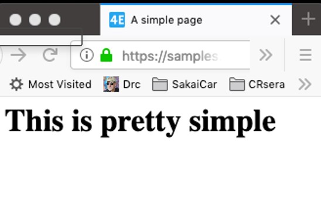
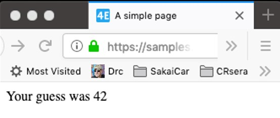
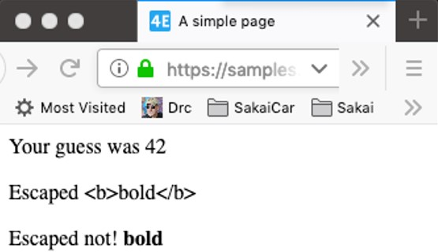
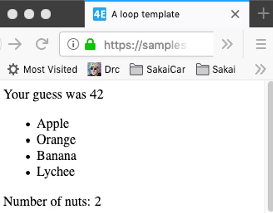
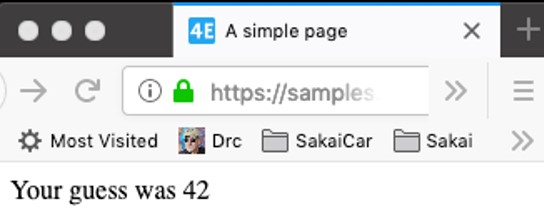
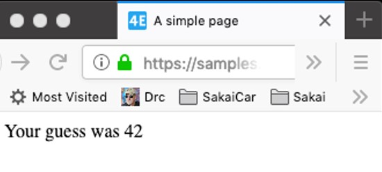

# Index

- [Index](#index)
- [DJango Template Language DTL](#django-template-language-dtl)
- [Examples](#examples)
  - [No rendering returning a noraml htlm page.](#no-rendering-returning-a-noraml-htlm-page)
  - [Taking local parameters](#taking-local-parameters)
  - [use of safe modifier](#use-of-safe-modifier)
  - [loops](#loops)
  - [Nested variables](#nested-variables)
  - [Data coming from the url request](#data-coming-from-the-url-request)

<br>
<br>
  
# DJango Template Language DTL
```html
<!-- substitution -->
{{ zap }}
{{ zap|safe }}

<!-- Calling code -->



<!-- Logic -->



<!-- Blocks -->



```

Everything between double curly braces is automatically scaped so is secure to use. But you could deactivate this with the safe modifier `{{zap|safe}}`.

You can call code. Function and pass it parameters like `` is using `url` fucntion and passing `cat-datail` parameter and `cat.id`.

We can use things like logic ant this like that is very similar to python code. Maybe you have to learn a little more syntax but essentially is the same.

Finally we have **blocks** in the block we can insert another template inside.
  
  
# Examples

Here are displayed some uses of this language.
  

<br>
<br>

## No rendering returning a noraml htlm page.
```
https://samples.dj4e.com/tmpl/simple

```

```html
<!-- dj4e-samples/tmpl/templates/tmpl/simple.html -->
<html>
<head>
    <title>A simple page</title>
</head>
<body>
    <h1>This is pretty simple</h1>
</body>
</html>
```

  
<br>
<br>

## Taking local parameters

This example take a local varialble from view object
```
https://samples.dj4e.com/tmpl/guess

```
```python
def guess(request) :
    context = {'zap' : '42' }
    return render(request, 'tmpl/guess.html', context)

```

```html
<!--dj4e-samples/tmpl/templates/tmpl/guess.html -->

<html>
<head>
    <title>A simple page</title>
</head>
<body>
    <p>Your guess was {{ zap }}</p>
</body>
</html>

```

  
<br>
<br> 
  
## use of safe modifier
```
https://samples.dj4e.com/tmpl/special
```
```python
def special(request) :
    context = {'txt' : '<b>bold</b>',
               'zap' : '42' }
    return render(request, 'tmpl/special.html', context)

```

```html
<!-- dj4e-samples/tmpl/templates/tmpl/special.html -->

<body>
   <p>Your guess was {{ zap }}</p>
    <p>Escaped {{ txt }}</p>
    <p>Escaped not! {{ txt|safe }}</p>
</body>

```

  
<br>
<br>
  
## loops

Here we must to note that we pass a dict and every key in the dick is var in the template context.  So if we pass a list like a element of dict this will we a var-list with name of the previous key hold it.

In the same template we can see that we are using a different syntax for an attribute of a list. The attribute lengh is access by `listvar|lenght`.

```
https://samples.dj4e.com/tmpl/loop
```

```python
def loop(request) :
    f = ['Apple', 'Orange', 'Banana', 'Lychee']
    n = ['peanut', 'cashew']
    x = {'fruits' : f, 'nuts' : n, 'zap' : '42' }
    return render(request, 'tmpl/loop.html', x)

```
```html
<!-- dj4e-samples/tmpl/templates/tmpl/loop.html -->

<ul>

<li>{{ x }}</li>

</ul>

    <p>Number of nuts: {{ nuts|length }}</p>

    <p>No nuts.</p>


```

  
<br>
<br>  
  
## Nested variables

This nested variables are like objects attributes access in classes. They are composed by nested dictionarys maybe because a dictionary in pyhon is very similar to one JSON object.

```
https://samples.dj4e.com/tmpl/nested
```
```python
def nested(request) :
    x = {'outer' : { 'inner' : '42' } }
    return render(request, 'tmpl/nested.html', x)

```

```html
<!-- dj4e-samples/tmpl/templates/tmpl/nested.html -->
<body>
    <p>Your guess was {{ outer.inner }}</p>
</body>

```


  
<br>
<br>

## Data coming from the url request

In this example we are receiving data from the url. This is like we've already done with other examples the unique difference is to manage the data coming from the url but that is done by the `url.py` file and view declarion in `view.py`.

Note even we declare the type of variable in the path is good practice to convert it with python to the correct type becuase is not necessary converted always.

```
https://samples.dj4e.com/tmpl/game/200

```
```python
# url.py
 path('game/<slug:guess>', views.GameView.as_view())

```
```python
#views.py
class GameView(View) :
    def get(self, request, guess) :
        x = {'guess' : int(guess) }
        return render(request, 'tmpl/cond.html', x)

```

```html
<!-- dj4e-samples/tmpl/templates/tmpl/cond.html -->

<p>Your guess was {{ guess }}</p>

    <p>Too low</p>

    <p>Too high</p>

    <p>Just right</p>


```

