# Notes for Django for everyone

## index

- [Notes for Django for everyone](#notes-for-django-for-everyone)
  - [index](#index)
  - [Recomendations](#recomendations)
  - [Introduction](#introduction)
    - [Get](#get)
    - [URL](#url)
    - [Hypert text protocol](#hypert-text-protocol)
    - [IP protocol](#ip-protocol)
      - [Request](#request)
  - [Making a request with telnet](#making-a-request-with-telnet)
    - [Network sockets](#network-sockets)
    - [Making a simple client in python](#making-a-simple-client-in-python)
  - [Making a simple server](#making-a-simple-server)
    - [A simpler client but in higher level of abstraction (url)](#a-simpler-client-but-in-higher-level-of-abstraction-url)
  - [Dev broser tools](#dev-broser-tools)
    - [Network tab](#network-tab)

## Recomendations

Network book to read: Introduction to Networking by Charles R. Severance

## Introduction

This course main focus in the baskend the data manage. This can be seeing this:

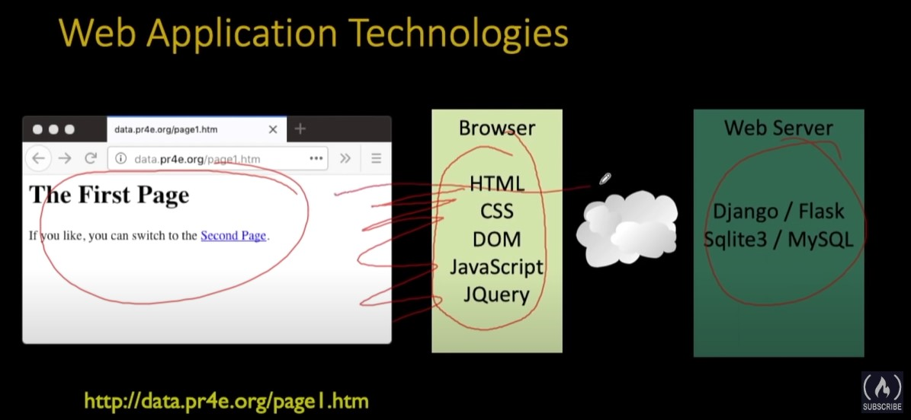

In the front-end we have a lot of technologies like:
1. css
2. html
3. DOM
4. JavaScript
5. JQuery

This technologies are important to display imformation but not to manage data for that reason is used python with `Django` for development in the *back-end*.

### Get 

Basically when a user makes click in an anchor (`<a>`) to redirect to new page this send a `GET` petition and receive an html document that the browser formats and display to the screen.

That is the basic sicle in petition and response used in web development.

**The Broser** is a program runing in your pc and is constantly waiting for inputs (keyboard, mouse, etc). So you will click something and find their way to resolve your petition.

**Cumunication through internet (Request cicle)** To enable the comunication through web we use web sockets. A web socket is a direction plus a port (127.0.0.1:8000). Our request has special format (standard) to be able to comunicate with other pc. When we comunicate to the server (the other pc) this analyse our request and execute its content to respond the correct information and then send it back for the same port.

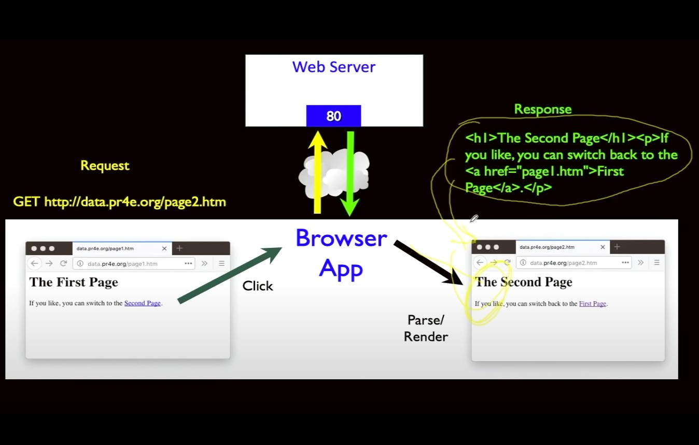

### URL

Is a easy protocol to use in a lot of applications. This protocol enable a lot of thigs and fucntionalities. One of the basic is identify resources through the network by an url (**Uniform Resourse Locator**):

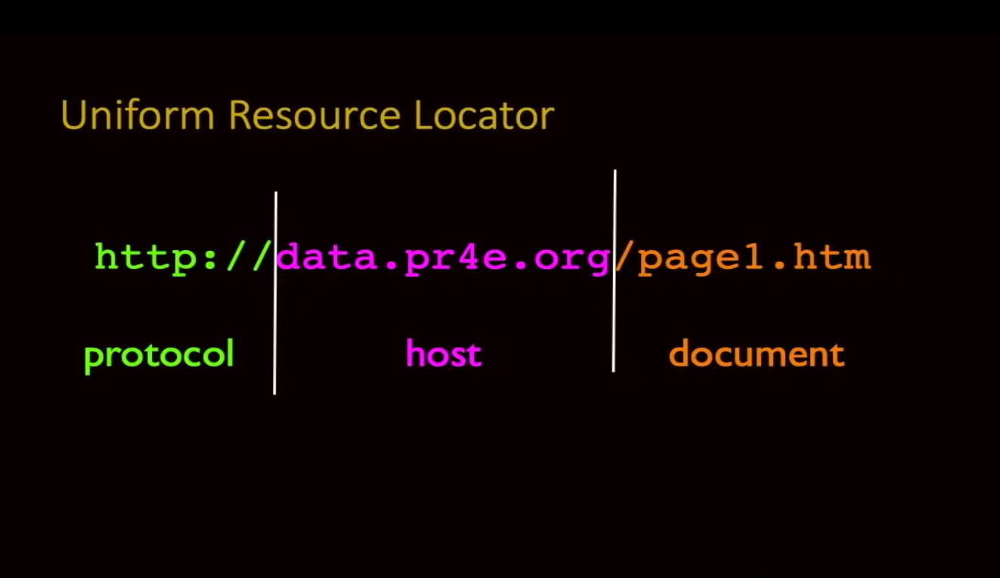

`uri` control three important thigs:
1. protocol: It eneble the use of multiple protocols.
2. Host: Identify the direction of the equipment we want to send our request.
3. document: Identify the resource.

### Hypert text protocol

The sockets were invented in 1970 and before the 1990 there were too many protocol that uses this syntax but http overcome and today is almost the default technology to use in the web.

Initialy this protocol was use to retrieve:
1. Images
2. Documents
3. etc.

After this protocol was modificated to make more complicated things. Different engineers make modifications to retrieve more thigs, something amazing!.

One the reason this was so succesful was that is open software. So every can make a lot of things without worring about the complicated legal things and so on. After this was levarage with the rfc's (request  for commentaries) in this way everybody can collaborate to make great things and is fundamental.

In one of these rfc the ip protocol born and is fundamental to understand it to know how the internet works.

### IP protocol

This protocal can be find it [here](https://tools.ietf.org/html/rfc791). In this document we can find a lot of interesting thigs.

#### Request

In this protocol is defined the request to a server manage information. In the header of the request can be many informatin about the client like the type of browser or special requerements to use. Even the kind of computer and os used to make the request to the server.


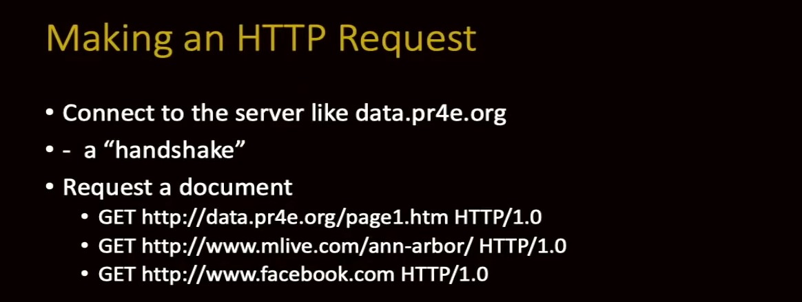


## Making a request with telnet

Telnets is a basic tool to make request over the web. Is no more included because doesn't manege encription in the comunication so is very inseecure to use. 

In the next image first try to make a connection with the first command, if this  succesed is necessary to send what we are trying to do with the server. In this example is `GET` request trying to adquire a html document. The next line  is blank to sey to the server that we are sending headers, converserly, we put the headers here.

Next we receive the server response the first chunk of information is the header of the server and then a blank line. After the information we request it, this can be anything like images, video or somethig else. This is inferred by the las line the hader where it states `Content-Type`.

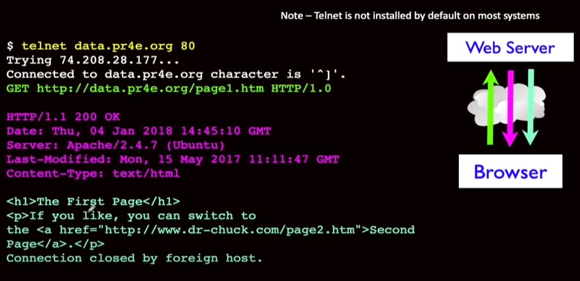


The next step would be to render the page by the browser to be shown in the screen.

### Network sockets

This was originally think to be like phone call between computers. But from the begining the conections are not permanent is more share messages following a protocol. One rule of this protocol is than the client must to talk first to the server.

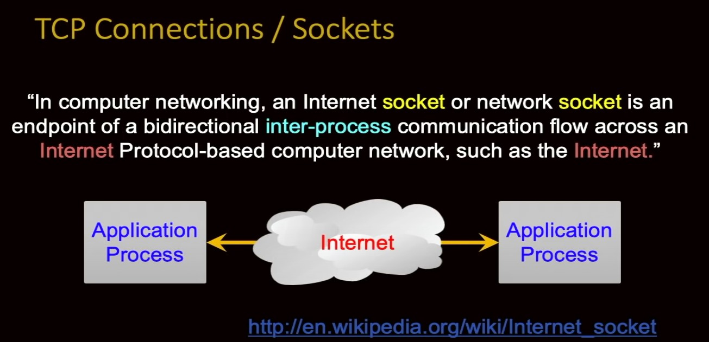

Is important to note that your program is not talking directly with the server is talking with another program (application). We use the internet like intermediary.

**TCP Port Numbers**

* A port is an application-specific or process-specific software communications endpoint.
* It allows multiple networked application to coexist on the same server.
* There are a list of well-know TCP port numbers.

The TCP ports are a good way to know to what application we are talking to this is its main porpurse is like phone extention.

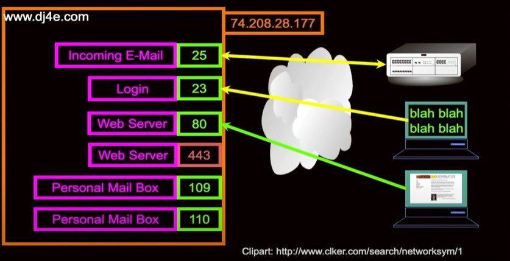

in the previos image we can see that in one computer with the ip (72.208.28.177) hold different applications running at the same time. We use distinct sockets to talk with one or another application. Every application can use a differente protocol this is showed with different color arrows, an email application spects a email protocol or login protocol to talk with a login.

For testing is very use the port 80 to development and for production the port 443 is used.

### Making a simple client in python

Let to make a connection to a socket with Python:
1. Lets to create a socket in two phase
   1. create the socket object
   2. make the connection (call)
2. After is necessary to send the request this made with the syntax `'GET http://data.pr4d.org/page1.htm http/1.0\r\n\r\n'.encode()` remember that we are the client and we need to talk first. **Note** The last part include the blank line to tell the server that we don't send headers in the request. The `\r\n` is used for simulate the `enter` button. `encode()` is used to use **utf-8** the usual way to talk in web sockets. 
3. Next, is neccesary to have a loop to receive the data. Receive 512 characters per iteration if we no longer receive data the loop ends. This part of the code has a big caveat becuase is a blocking operation  meanwhile receive the data.
   1. Receive 512 characters.
   2. See if we keep receiving data.
   3. print the data to the standard output.
4. Finally we close the socket.

   
```python
import socket

mysock = socket.socket(socket.AF_INET, socket.SOCK_STREAM)
mysock.connect(('data.pr4e.org', 80))
cmd = 'GET http://data.pr4e.org/page1.htm HTTP/1.0\r\n\r\n'.encode()
mysock.send(cmd)

while True:
    data = mysock.recv(512)
    if len(data) < 1:
        break
    print(data.decode(), end='')

mysock.close()

```

The code resonse is:

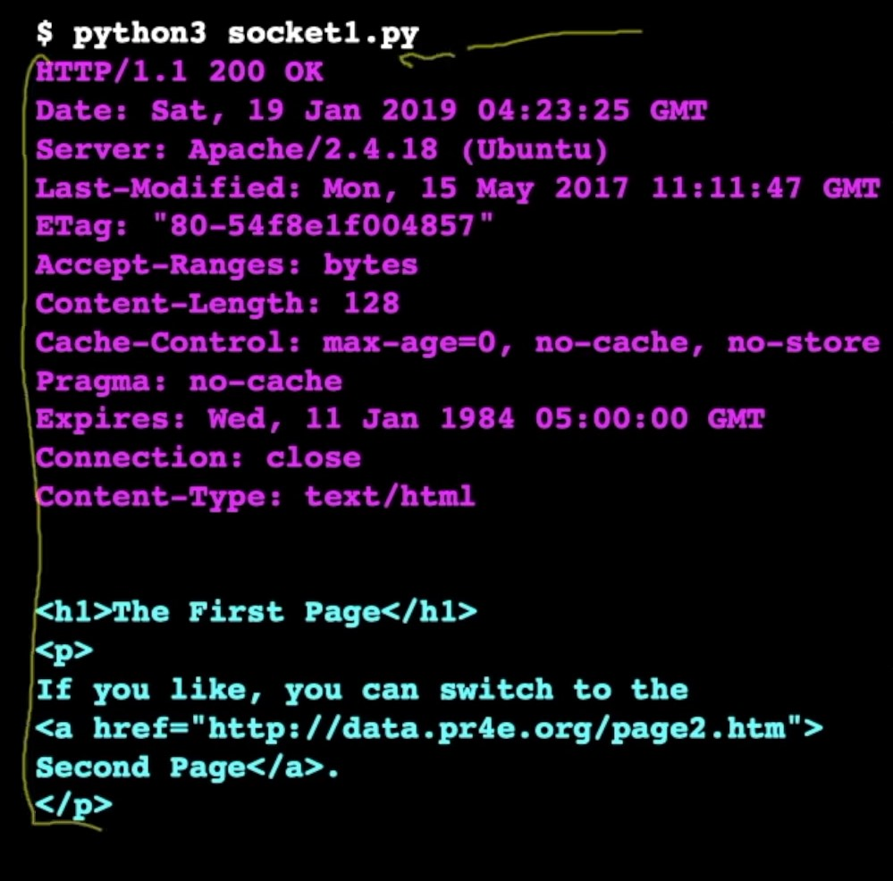

**Develope tools in browser**

Nowadays, we use the dev mode in browser this tool help us to see the header and the debug mode show us when a request is slowing down the site.

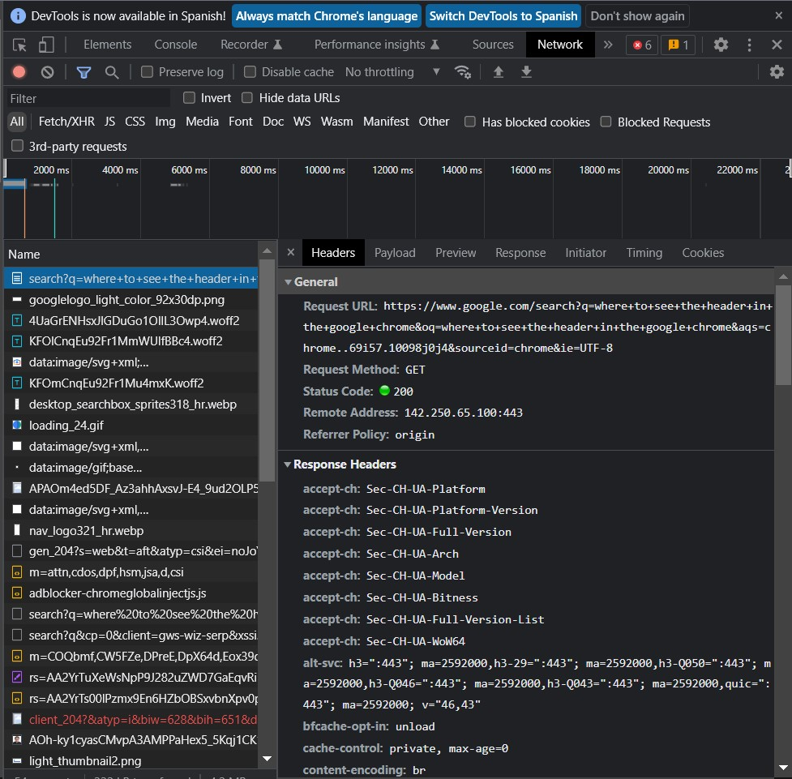

## Making a simple server

Next we build a very simple server this server will return the same response without import what is the request.

There are several step to explain how this script works:
1. The socket is instantiated
2. The socket is binded (with the `bind` method` to host and port (this port is address where the app will be waiting for a call)
3. The sockt use the method `listen(5)` this is the the system will stack until five calls (stack)
4. The server loop:
   1. the function `accept()` in the socket will be waiting and block the ejecution until a request is received.
   2. When a request is received the second line of the loop will execute and recieves 5000 character in  utf-8 that need to be decoded to unicode (Python standar for characters)
   3. Then the server print to the `stdout` the first elemnt of the request header
   4. The data is prepared to send it (`data`)
   5. The `data` is sent by `sendall()` method in a encoded way
   6. For standar after to respond a request the socket need to be closed
5. Aditional `except`statement are added to manaje error and server shutdown

```python
import socket

def create_server():
    serversocket = socket.socket(socket.AF_INET, socket.SOCK_STREAM)
    try:
        serversocket.bind(('localhost', 9000))
        serversocket.listen(5)

        while(True):
            (clientsocket, address) = serversocket.accept()

            rd = clientsocket.recv(5000).decode()
            pieces = rd.split("\n")
            if(len(pieces) > 0 ): print(pieces[0])

            data = "HTTP/1.1 200 OK\r\n"
            data += "Content-Type: text/html; charset=utf-8\r\n"
            data += "\r\n"
            data += "<html><body>Hello World</body></html>\r\n\r\n"
            clientsocket.sendall(data.encode())
            clientsocket.shutdown(socket.SHUT_WR)

    except KeyboardInterrupt:
        print("\nShutting Down... \n")
    
    except Exception as err:
        print("Error:\n")
        print(err)
    
    finally:
        serversocket.close()
    
    

def main():
    print("Access http://localhost:9000")
    create_server()

if __name__ == "__main__":
    
    main()

```

The reponse redered in the browser look like of this way:

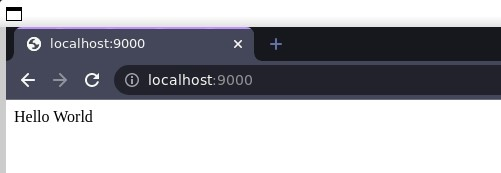

We can go further and make modify our previous [client app](#making-a-simple-client-in-python) to send the request to our server. These are a few sustitutions in the code we only need to change the host name and port to talk to.

### A simpler client but in higher level of abstraction (url)

Manaje sockets directly is very low level. Today there are few resons to manage sockets in that way. Now we have modules that can manage all the low level things.<br> `urllib` is library can manage conection the socket only providing the full `ulr` to talk to.

```python
import urllib.request

fhad = urllib.ruquest.urlopen('http://127.0.0.1:9000/romeo.txt')
for line  in fhad:
    print(line.decode().stript())

```
This is a very short code to have a client working on. It's really amazing how the libraries can help us too much!. This code work in the http level `url` is http level thing!


## Dev broser tools

This is basic travel through the tools browser to debug web applications.

The web application are difficult to debug is for that reason browser offers tools to debug web application.

In Google-chrome we can access to these tools by use `ctrl+shift+i`.

### Network tab

To build a web page a web application needs to do multiple requeest to the server. These ruquest are tracked in `network` tab. This tool takes all the requests and register things like time to take the server to respond, reques status (200, 404, etc), type of data, header, etc.

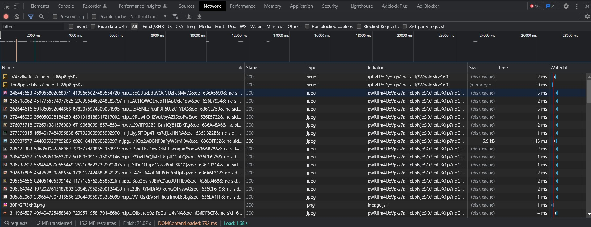

