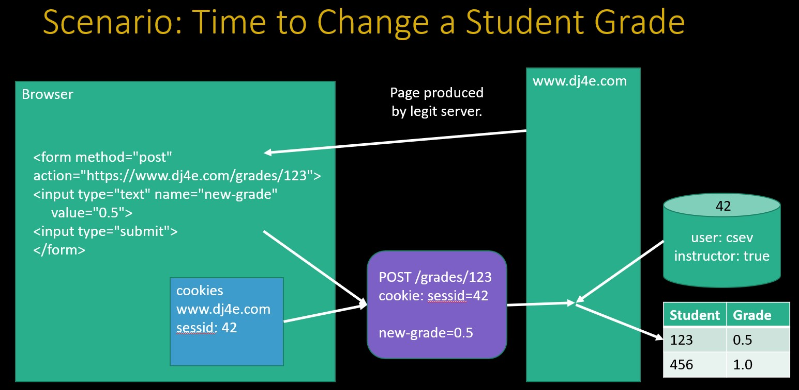
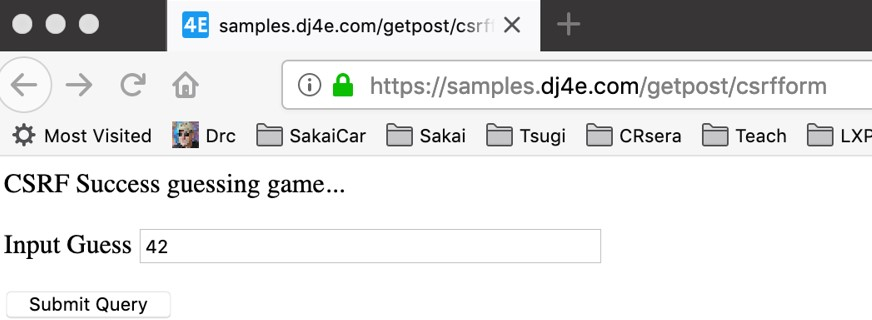

# Cross-Site-Request-Forgery (CSRF)

This is a kind of attack when third site generate a form that try to submit/change data to the legitimate server. This is done by taking a form and submit it to the real server. The malicious form request takes the session id cookie from the browser and sent it with the information. To avoid this is necessary to put a hidden input in the form when in created by the legitimate server by this the server only will accept form generated/signed by it.

**Note** DJango comes with utility by default to avoid this kind of attack. But you need to include in your code or you will receive a 403 (forbidden resources) response from the server.

Attack
> A rogue site generates a page that includes form that posts data to a legitimate site where the user is logged in via a session cookie
> The form is submitted to the legitimate site and the cookie is included
> The legitimate site accepts the request because of the cookie value
> 
> Note that the rogue site does not need to know the cookie value – it just knows that the cookie will be sent on requests to the legitimate site

[wiki](https://en.wikipedia.org/wiki/Cross-site_request_forgery)

Defense
> The legitimate site chooses a large random number (the CSRF Token) and puts it in the session
> When the legitimate site generates a POST form, it includes the CSRF Token as a hidden input field
> When the form is submitted the CSRF Token is sent as well as the cookie
> The site looks up the session and rejects the request if the incoming CSRF Token does not match the session's CSRF Token

## Image normal operation


## Attack with out proteccion


## Attack with proteccion


## Attack blocked


# Using CSRF in DJango

To ovoid the CSRF in DJango you must to take care of the detail of implementation.

## Incorrect way to use DJango with CSRF

When we first take care of a form in DJango we must to use a decorator to avoid that DJango complait about a bad implementation of CSRF security function. 

```python
#dj4e-samples/getpost/views.py

@csrf_exempt # This deactivate validation of CSRF token
def postform(request):
    response = """<p>Impossible POST guessing game...</p>
        <form method="POST">
        <p><label for="guess">Input Guess</label>
        <input type="text" name="guess" size="40" id="guess"/></p>
        <input type="submit"/>
        </form>"""

    response += dumpdata('POST', request.POST)
    return HttpResponse(response)

```

The correct way to use it its the next

```
https://samples.dj4e.com/getpost/failform
```

```python
def failform(request):
    response = """<p>CSRF Fail guessing game...</p>
        <form method="post">
        <p><label for="guess">Input Guess</label>
        <input type="text" name="guess" size="40" id="guess"/></p>
        <input type="submit"/>
        </form>"""

    response += dumpdata('POST', request.POST)
    return HttpResponse(response)

```
But if you use this in this way it will fail.


## Manual way to use CSRF in DJango

In this part we will see a manual way to implement CSRF in DJango.  We will generate the token for CSRF and latter send it as plain html string. An important thing on this is to use the correct name of the hidden input element to `csrfmiddlewaretoken` in this way DJango will recognize it as soon it preprocess.

```
https://samples.dj4e.com/getpost/csrfform

```

```python
from django.middleware.csrf import get_token

def csrfform(request):
    response = """<p>CSRF Success guessing game...</p>
        <form method="POST">
        <p><label for="guess">Input Guess</label>
        <input type="text" name="guess" size="40" id="guess"/></p>
        <input type="hidden" name="csrfmiddlewaretoken" 
            value="__token__"/> 
        <input type="submit"/>
        </form>"""

    token = get_token(request)
    response = response.replace('__token__', html.escape(token))
    response += dumpdata('POST', request.POST)
    return HttpResponse(response)

```
We will get in a correct way the file rendered and the final html will look in this way:



```html

<p>CSRF Success guessing game...</p>
<form method="POST">
<p><label for="guess">Input Guess</label>
<input type="text" name="guess" size="40" id="guess"/></p>
<input type="hidden" name="csrfmiddlewaretoken"
  value="fSv596BjrYhRoBkJO08jWm0h3TrTxqiIj5x32K0vXgHaHjSlX33UCJfz52b0CVa2"/>
<input type="submit"/>
</form> 

```
In the next image we can see the post and the information that it contains. With this information is the random number generated by the server and used as token to the form validation.


## Use of the CSRF with templates

this is preferred way to manage an CSRF token. We can use a template with a form this form will use a special identifier `` to tell generate the ranodom number and incrusted in directly to the html. This number can be configured to be changed in a time lapse for more security.

```html
<!-- dj4e-samples/getpost/templates/getpost/guess.html -->

<p>Guessing game</p>

<p>{{ message }}</p>

<form method="post">
<p><label for="guess">Input Guess</label>

<input type="text" name="guess" size="40" id="guess"/></p>
<input type="submit"/>
</form>

```
## Example of using CSRF in DJango

To show how this work firts lets to make a function (utility function) to show some information to debug.
```python
# dj4e-samples/getpost/views.py

# Call as checkguess('42')
def checkguess(guess) :
    msg = False
    if guess :
        try:
            if int(guess) < 42 :
                msg = 'Guess too low'
            elif int(guess) > 42 :
                msg = 'Guess too high'
            else:
                msg = 'Congratulations!'
        except:
            msg = 'Bad format for guess:' + html.escape(guess) 
            # remember is importan to escape information that is
            # coming from the user

    return msg

```

Lets to use class view to easily implement a response for the get and post method to same url. This is one of the adventages to use a class as view.

1. In the `get` method only return the template to the user. But this template already has a CSRF token on it. So since first time the user `GET` the page gets the token as well.
2. In the `post`  method the user `POST` data to the server using the form. This form is not rejecte becuase the `get` method already include the CSRF token in the form.


```python
# dj4e-samples/getpost/views.py

class ClassyView(View) :
    def get(self, request):
        return render(request, 'getpost/guess.html')

    def post(self, request):
        guess = request.POST.get('guess')
        msg = checkguess(guess)
        return render(request, 'getpost/guess.html', {'message' : msg })


```

The template to use. Nothe tat the templete use the `` to add the CSRF  random number protection. 

```html
<!-- dj4e-samples/getpost/templates/getpost/guess.html -->

<p>Guessing game</p>

<p>{{ message }}</p>

<form method="post">
<p><label for="guess">Input Guess</label>

<input type="text" name="guess" size="40" id="guess"/></p>
<input type="submit"/>
</form>

```

