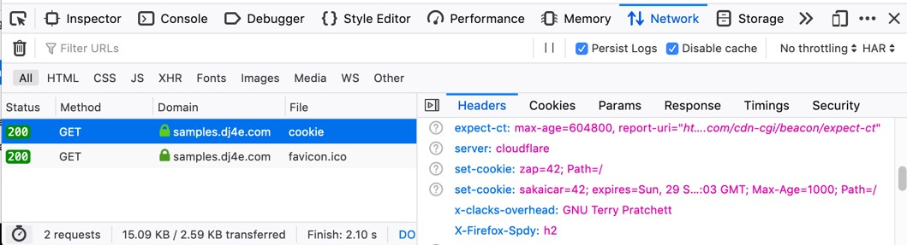
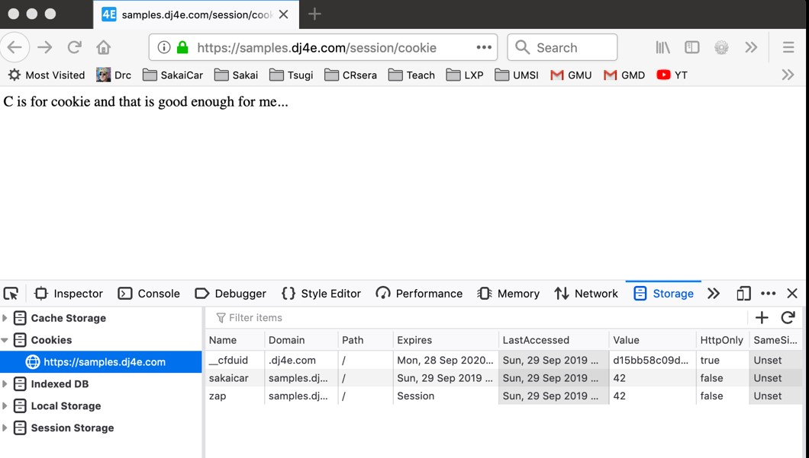
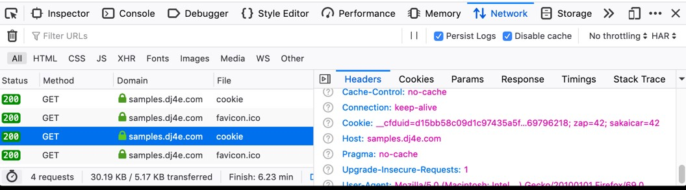
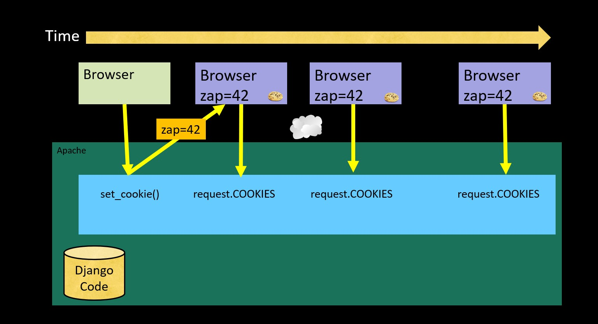

# Index

- [Index](#index)
- [Cookies](#cookies)
  - [Cookies in the browser](#cookies-in-the-browser)


# Cookies

The cookies are a concep of the browser side (client side). When you have a server ideally we thought we can only talk with a browser. But in the reality we are talking with tousands of web broser at the same time and we do not have a permanent session open with a browser. 

We need a way to recognize with which browser we are talking to. Because the conection is not premanent. So we need to put a marker in every broser to identify it from another.

> Technically, cookies are arbitrary pieces of data chosen by the Web server and sent to the browser.  The browser returns them unchanged to the server, introducing a state (memory of previous events) into otherwise stateless HTTP transactions.  Without cookies, each retrieval of a Web page or component of a Web page is an isolated event, mostly unrelated to all other views of the pages of the same site. 

[wiki info](http://en.wikipedia.org/wiki/HTTP_cookie)

## Cookies in the browser

* Cookies are marked as to the web addresses they come from. The browser only sends back cookies that were originally set by the same web server.
* Cookies have an expiration date. Some last for years, others are short-term and go away as soon as the browser is closed


```python
# https://github.com/csev/dj4e-samples/blob/master/session/home/views.py

 def cookie(request):
     print(request.COOKIES)
     resp = HttpResponse('C is for cookie and that is good enough for me...')
     resp.set_cookie('zap', 42) # No expired date = until browser close
     resp.set_cookie('sakaicar', 42, max_age=1000) # seconds until expire
     return resp

```
log
```
[29/Sep 23:17:55] "GET /session/cookie HTTP/1.1" 200 26
{'sessionid': 'xy414ikma0p80jw19mrg146inewhzp3s', 'zap': '42', 'sakaicar': '42'}

```

We can see the cookies in the dev tool from the browser.In the headers response section  we can see in the section `set-cookie` what cookies are setting by the  `get` response.


After we can see the cookies in memory (section memory). Here we can see information about cookies attributes like expiration date.



After this in every petition the cookies are send to the server. As `cookies` header in key-value pair way. And the server not send again the cookies to the browser.



This process is depicted in the next image:



The continuation of this is the session part.
