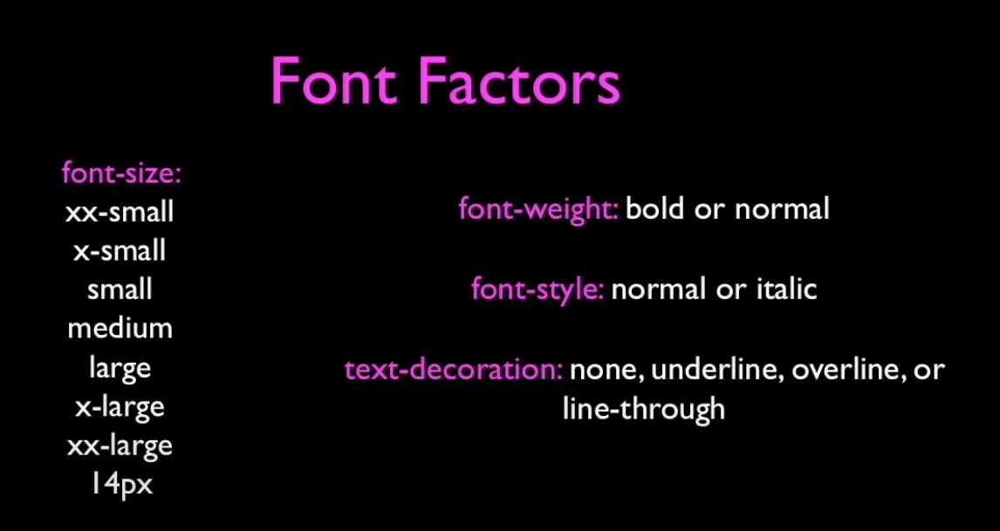

# CSS

## index

- [CSS](#css)
  - [index](#index)
  - [Introduction](#introduction)
  - [Syntax](#syntax)
  - [Where to place the css](#where-to-place-the-css)
    - [cascading](#cascading)
    - [div and span tags](#div-and-span-tags)
    - [id and another things](#id-and-another-things)
  - [Images, Colors and Fonts](#images-colors-and-fonts)
  - [surfing for the a website with css](#surfing-for-the-a-website-with-css)

## Introduction
For this part is recommended that you have one extention that allow to see a web page with out css:

[Broser extention](http://chrispederick.com/work/web-developer/)

A page is composed mainly two files one file that contains  the html and other that have the css. The later is has all the instruction to the browser make the html presentable and beuty to the public.

Is pausible to have css and html in one file but nowadays is think to be in separated files.

The html files are created in the backed and the css files are created by one designer to add consistency to the page.

So you can hava very specialiced in one area.

## Syntax

* Css has a syntax totally diferent to html
* CSS is a set rules which include a `selector` and one o more `properties` and `values` as well as some puntuation.

```css
body {
    font-family:arial, sans-serif;
}
```

we have three parts in css:
* **selector** (`body`)this es where the code wil apply the transformation.
* **Css property** (`font-family`) what is changed in the selected piece
* **Value**  (`sans-serif`) what values lets to assing to the key

there are too much keys to remenber and is always good idea to seach the values we can change in an css object.

## Where to place the css

This can be placed in the header or the footer. But the best idea is to put it on other file and import that file to our project.

Because there are various ways to do this only will show to you what is the best way: import the file:

```html
<html>
    <head>
        <title>Including CSS From a file</title>
        <link type="text/css" rel="stylesheet" href="rules.css">

    </head>
    <body>
        ...
    </body>
</html>
```

**Nota** The `rules.css` must have in the same folder. Because the link is relative, but we can change it to be another side.

### cascading

The styles from css are applied in cascading method this is: we have general styles applied to all document and then more specific styles for every element. And then the general styles are applied to all elements but if exists another styles applied to that element will overwrite these and preserve the other that doen't have conflict with it.

### div and span tags 

The div and span tags doesn't have previous style inhireted by an old default convention.

They start with nothing all the values are none or 0. This give us the ability to change and manipulate the object to our plesure.

### id and another things

All the id are unique for the id used. This are useful if want to modify specific elments.

Another selector is the `class` attribute. This can be assingned to distict elements.

```css

/* appliing to an tag */
h1{
    color:red;
}

/* id */
#idattribute{
    color:red;
}
/* class attribute */
.class{
    color:red;
}

```

## Images, Colors and Fonts

The information of the color usually is used in hex code. The firt three pair are the color and fourth (if exists) is the transparency (alpha).

```css
#ffffff00

```
The fonts are a list of priority:


There are different factors fonts to use the applications:



The links are somethig realy importan for that reason have a lot of configurations


## surfing for the a website with css

In this part is more easy to see the explanation in the video:
[video](https://www.youtube.com/watch?v=o0XbHvKxw7Y) at the minute 03:03:05
