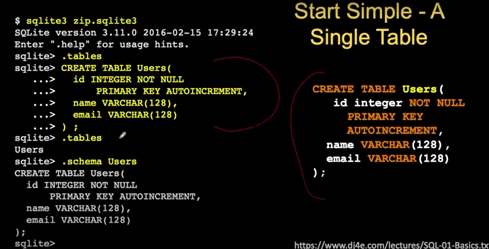
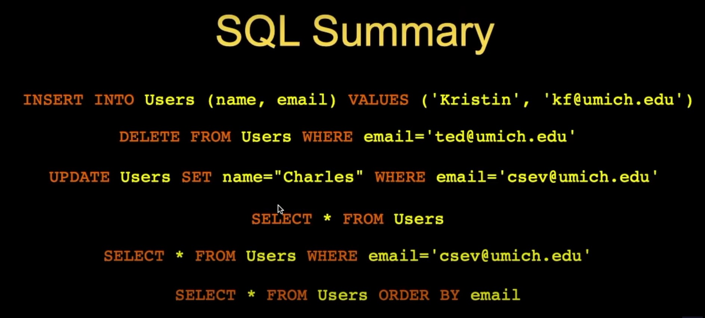
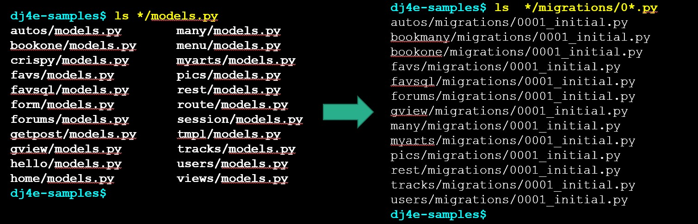
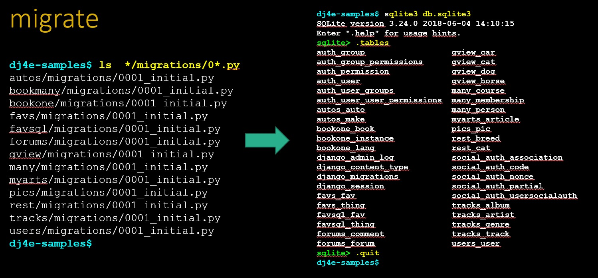

# Data bases intro
Usually in raltional data bases is used the sql language to manage data to application or users.


## index

- [Data bases intro](#data-bases-intro)
  - [index](#index)
  - [SQLite3](#sqlite3)
  - [SQL with DJango](#sql-with-django)
  - [`makemigration` and `migration`](#makemigration-and-migration)
    - [`makemigrations`](#makemigrations)
      - [re-runing `makemigration`](#re-runing-makemigration)
    - [`migrate`](#migrate)
      - [re-runing `migrate`](#re-runing-migrate)
    - [Exaple of using `makemigraions` and `migrations`](#exaple-of-using-makemigraions-and-migrations)
  - [python manage.py shell](#python-managepy-shell)
  - [Basic comands with DJango database](#basic-comands-with-django-database)

## SQLite3

This database is the most simple database engine. This manage all the database as unique file for that reason is easy to use and manage.

You only need to install and then use the file that contains your database like this:



An brief example of fucntions that are managed by SQL in genearl are:



There are too many application that manages SQL as standard. You can learn about 60% in how to use SQL but the last 40% is dependant of the implementation of the vendor. This could be a headache because you need to change your program to manage the database.

## SQL with DJango

DJango comes with abstraction that let you use multiple SQL data engines using Python. This is very useful because you only need to connect the database and learn only one interface to talk with all the engines.

This know as **ORM** (object ralational mapping). This abstraction allows to:
* Map tables to objects and columns
* We use this objects to store and retrive data from the database
* improved portability across multiple engines like SQLite, MySQL, Postgres, Oracle, etc.

In DJango we need to change stablish the data in object oriented way:
```sql
CREATE TABLE Users(
    name VARCHAR(128),
    email VARCHAR(128)
);
```

```python
# model.py
from django.db import models

class User(models.Model):
    name = models.CharField(max_length=128),
    email = models.CharField(max_lenght=128)
```

## `makemigration` and `migration`

Once we defined the model is necessary to build the relation between the python code and the table in sql this allows to communitcate with the database. This is done with `python manage.py makemigrations` this command make files to be more specific crate a set of migration scripts. Then to apply these scrip is used `python manage.py migrate` to manipulate the database. And the end `migrate` create the database. You could use different databases in production and  development enverimonts and there is no problem.

### `makemigrations`
 
* The makemigrations command reads all the models.py files in all the applications, end creates / evolves the migration files
* Guided by the applications listed in settings.py
* Migrations are portable across databases

Inside every file that has a `models.py` file will create a migration file.



**note:** Never change this files, this files must to be generated by `makemigrations` command.

#### re-runing `makemigration`

Sometimes is necessary to re run migraitin command this but first is necessary to delete older files that `makemigrations` bullt before. Especially that ones with prefix 0.

```
$ rm bookone/migrations/0001_initial.py
$ python3 manage.py makemigrations

Migrations for 'bookone':
  bookone/migrations/0001_initial.py
    - Create model Book
    - Create model Instance
    - Create model Lang
    - Add field lang to book

dj4e-samples$

```

### `migrate`

* The migrate command reads all the migrations folders in the application folders and creates / evolves the tables in the database (i.e. db.sqlite3)



**note:** Can be multiple files with the same name, this is ok because every file tracks changes between files in model declaration and this works incrementally.

#### re-runing `migrate`

In the case you want to re-run `migrate` again. You could simple erase the database in this will make you start from scratch database totally empty. This is the worst escenary.

```
dj4e-samples$ rm db.sqlite3 
dj4e-samples$ python3 manage.py migrate

Operations to perform:
  Apply all migrations: admin, auth, autos, bookone, contenttypes, ...
Running migrations:
  Applying contenttypes.0001_initial... OK
  Applying auth.0001_initial... OK
  Applying admin.0001_initial... OK
  Applying admin.0002_logentry_remove_auto_add... OK
  Applying contenttypes.0002_remove_content_type_name... OK
  Applying auth.0002_alter_permission_name_max_length... OK
[ ...snip ... ]
  Applying social_django.0008_partial_timestamp... OK
  Applying tracks.0001_initial... OK
  Applying users.0001_initial... OK

dj4e-samples$ 

```

**Django and tables in sql**

Django creates tables that maintains registers of what tables are to updated with the currently migration files.


### Exaple of using `makemigraions` and `migrations`
```
$ cd ~/dj4e-samples
$ python3 manage.py makemigrations
Migrations for 'users':
users/migrations/0001_initial.py
    - Create model User

$ python3 manage.py migrate
Running migrations:
Applying contenttypes.0001_initial... OK
...
Applying sessions.0001_initial... OK
Applying users.0001_initial... OK

```

after the migration DJango create a lot of tables and information in the database that is neccesary to the model. But the table you crated is in the same database. In the next example we can see the table `user` created like `usermodel_user`.

```
$ cd ~/dj4e-samples

$ sqlite3 db.sqlite3

SQLite version 3.24.0 2018-06-04 14:10:15
Enter ".help" for usage hints.

sqlite> .tables
auth_group                  django_admin_log
[ ..snip ..]
auth_user                   django_session
auth_user_groups            users_user
auth_user_user_permissions

sqlite> .schema users_user
    CREATE TABLE IF NOT EXISTS "users_user" (
        "id" integer NOT NULL PRIMARY KEY AUTOINCREMENT,
        "name" varchar(128) NOT NULL,
        "email" varchar(128) NOT NULL
);

sqlite> .quit

```

In the last snipped of code we can see the schema is different with reference to the table we specified in python module. This is because python will take care of some columns like id, becuase between engines this tend to be differents.

## python manage.py shell

Is a special shell that load all the modules from DJango module to work with. You probably has problems if you try to make changes outside this shell. Inside this shell we could do thing like insert a new rocord to our database.

```
$ python3 manage.py shell

>>> from users.models import User
>>> u = User(name='Kristen', email='kf@umich.edu')
>>> u.save()
>>> print(u.id)
1

>>> print(u.email)
kf@umich.edu

>>>

```
is equivalent to:

```sql
INSERT INTO Users (name, email) VALUES ('Kristin', 'kf@umich.edu')
```

We can consult of the queries log we do throught the interface by:

```
>>> from django.db import connection
>>> print(connection.queries)

[
{'sql': 'BEGIN', 'time': '0.000'}, 
{'sql': 'INSERT INTO "users_user" ("name", "email") 
VALUES (\'Kristen\', \'kf@umich.edu\')',
'time': '0.002'}
]

>>>
```

## Basic comands with DJango database

```python
u = User(name='Sally', email='a2@umich.edu')
u.save()

User.objects.values() # get all the entries SELECT *   
User.objects.filter(email='csev@umich.edu').values() # Where

User.objects.filter(email='ted@umich.edu').delete() # Delete
User.objects.values()

User.objects.filter(email='csev@umich.edu').update(name='Charles') # SET
User.objects.values()

User.objects.values().order_by('email') # order by
User.objects.values().order_by('-name')

```

In the snipped `.values()` make the query to database. If you dont put it the query is not executed.

Can be a lot of different field types that exists in different sql databases but that is managed by DJango.db. So you don't have to worry about. Becuase DJango is layer (mapper) between your 

| AutoField       | EmailField            | PositiveSmallIntegerField |
|-----------------|-----------------------|---------------------------|
| BigAutoField    | FileField             | SlugField                 |
| BigIntegerField | FilePathField         | SmallIntegerField         |
| BinaryField     | FloatField            | TextFIeld                 |   
| BooleanField    | ImageField            | TimeField                 |
| CharField       | IntegerField          | URLField                  |
| DateField       | GenericIPAddressField | ForeignKey                |
| DateTimeField   | NullBooleanField      | ManyToManyField           |
| DecimalField    | PositiveIntegerField  | OneToOneField             |
| DurationField   |                       |                           |

