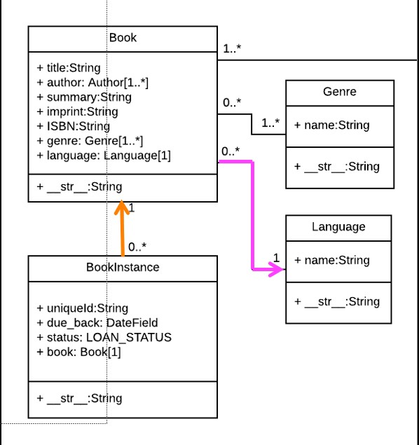

# Index

- [Index](#index)
- [DJango Shell](#django-shell)
- [Loading data (CSV) with a script](#loading-data-csv-with-a-script)
  - [Enable scrips in settings file](#enable-scrips-in-settings-file)
  - [Make the Script and dirs](#make-the-script-and-dirs)

# DJango Shell

The DJango shell is similar to python shell but there a big difference: the DJango shell load all the files of our project so are available to import to use it. This shell let us to explore the data and make another things realted to our project.



This image show of the structure of the tables are made. This is explored by the use in the shell, first lets to save some intances to entries in the database. Note how is not necessary to use the id to reference to another value in other table is only necessary to pass an object of the other table and django automatically find the id to use.

```python

$ cd ~/dj4e-samples
$ python3 manage.py shell
>>> from bookone.models import Book, Lang, Instance
>>> z = Lang(name='en')
>>> z.save()
>>> z.id
1
>>> x = Book(title='PY4E', isbn='42', lang=z)
>>> x.save()
>>> x.id
1
>>> a = Instance(due_back="2020-07-06", book=x)
>>> a.save()
>>> a.id
1
>>> quit()
$ 

```

This model allows to us to connect tables without the use of merge tables as usually is done with SQL syntax. Is only necessary to specify the table as attribute to make this wokrs like a merge.


```python
$ cd ~/dj4e-samples
$ python3 manage.py shell
>>> from bookone.models import Book, Lang, Instance

>>> x = Book.objects.get(pk=1)
>>> x
<Book: Book object (1)>

>>> x.title
'PY4E'
# note how using the book attribute 
# we can access to the other table (lang)
>>> x.lang.name
'en'

>>> y = Instance.objects.get(pk=1)
>>> y.due_back
datetime.date(2020, 7, 6)
# note how using the book attribute 
# we can access to the other table (book)
>>> y.book.title 
'PY4E'

>>> y.book.lang.name
'en'

>>> quit()
$ 

```

# Loading data (CSV) with a script 

Sometimes is necessary to load data from another source and this can be node through the use of a script but for this is necessary to activate some options in DJango.

This program will works like the python shell. Because needs to use the models created by DJango `makemigrations`. 

## Enable scrips in settings file

Is necessary to enable the Django extencion option in the `setttings.py` file.

```python
# dj4e-samples/settings.py

INSTALLED_APPS = [
    'django.contrib.admin',
    'django.contrib.auth',

[ ... ]

    # Extensions - see requirements.txt
    'django_extensions', # This option eneble the use of the scripts
    'crispy_forms',

[ ... ]

    'home.apps.HomeConfig',

    # Sample Applications - don't copy
    'hello.apps.HelloConfig',
    'getpost.apps.GetpostConfig',
    'users.apps.UsersConfig',

[ ... ]
]


```
## Make the Script and dirs

Inside the project is necessary to create first the dir and file `__init.py__` to make a module.

```
project-name$ mkdir scripts
project-name$ touch scripts/__init__.py
```

In this case lets to use csv file to upload it to the database this file and contents are like this:

```
dj4e-samples$ cat cats/meow.csv
Name,Breed,Weight
Abby,Sphinx,6.4
Annie,Burmese,7.6
Ash,Manx,7.8
Athena,Manx,8.9
dj4e-samples$

```
The models in the database are two tables as depicted here:

```python
from django.db import models

class Breed(models.Model):
    name = models.CharField(max_length=200)

class Cat(models.Model):
    nickname = models.CharField(max_length=200)
    breed = models.ForeignKey('Breed', on_delete=models.CASCADE, null=False)
    weight = models.FloatField()

```
The python script that used to do this is:

```python
import csv
from cats.models import Cat, Breed

def run():
    fhand = open('cats/meow.csv')
    reader = csv.reader(fhand)
    next(reader)  # Advance past the header

    Cat.objects.all().delete()
    Breed.objects.all().delete()

    # Name,Breed,Weight
    # Abby,Sphinx,6.4
    # Annie,Burmese,7.6
    # Ash,Manx,7.8

    for row in reader:
        print(row)

        b, created = Breed.objects.get_or_create(name=row[1])

        c = Cat(nickname=row[0], breed=b, weight=row[2])
        c.save()

```
To run the scrip is just done with:

```
dj4e-samples$ python3 manage.py runscript cats_load

```


