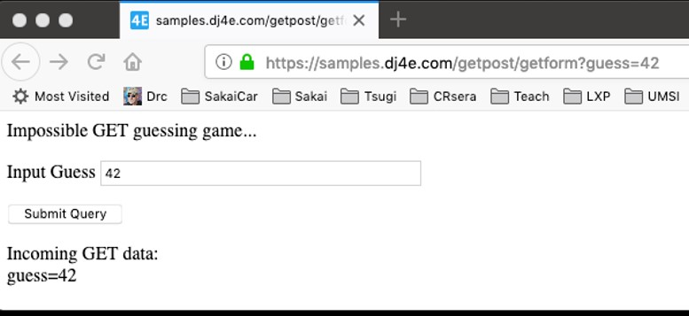
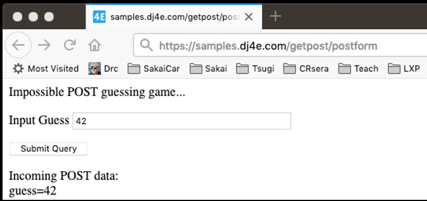
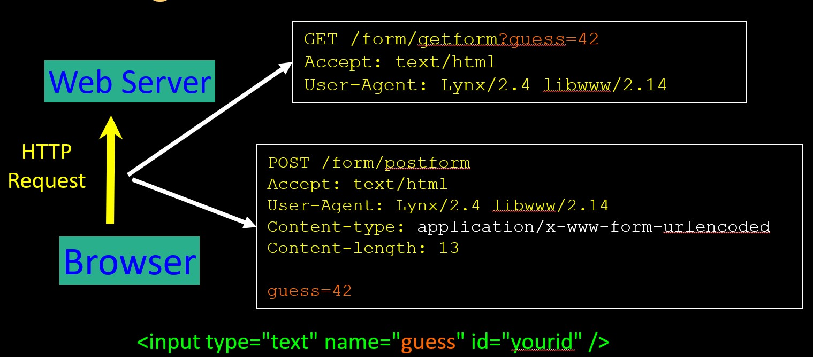

# Forms 

Two ways the browser can send parameters to the web server
* `GET` - Parameters are placed on the URL which is retrieved.
* `POST` - The URL is retrieved and parameters are appended to the request in the the HTTP connection.


##  Example using GET method

Here we are using a get method in the form. The GET method is the default way to send data by a form. The form in the moment of push the summit button send a request (GET) to the server by the same url. The information is parsed in the same url.

```python
# Call as dumpdata('GET', request.GET)

def dumpdata(place, data) :
    retval = ""
    if len(data) > 0 :
        retval += '<p>Incoming '+place+' data:<br/>\n'
        for key, value in data.items():
            retval += html.escape(key) + '=' + html.escape(value) + '</br>\n'
        retval += '</p>\n'
    return retval

```

```python
# dj4e-samples/getpost/views.py

def getform(request):
    response = """<p>Impossible GET guessing game...</p>
        <form>
        <p><label for="guess">Input Guess</label>
        <input type="text" name="guess" size="40" id="guess"/></p>
        <input type="submit"/>
        </form>"""

    response += dumpdata('GET', request.GET)
    return HttpResponse(response)

```

Note that in the following image the url box now has 42 as key-value pair. This is done by the form add this value to end of the url. Then the browser makes automatically a new request to the same url with the values. Is for this reason we can see the 42  rendered in the below part.

1. The html respond is rendered
2. We put a value (42) in the form then press submit
3. The value is parsed in the end of the url (guess=42)
4. A new request is send to same link (updated with values)
5. The new request is rendered
6. We can see the values sent it


```
https://samples.dj4e.com/getpost/getform
```


## Example using POST

This is almost the same but using the POST method in the form. So the form send instead a POST request to the serve with the same url. But the information is not in the url is send as payload in package.

```python
# dj4e-samples/getpost/views.py

@csrf_exempt
def postform(request):
    response = """<p>Impossible POST guessing game...</p>
        <form method="POST">
        <p><label for="guess">Input Guess</label>
        <input type="text" name="guess" size="40" id="guess"/></p>
        <input type="submit"/>
        </form>"""

    response += dumpdata('POST', request.POST)
    return HttpResponse(response)

```
```
https://samples.dj4e.com/getpost/postform

```


## When to use GET and POST

The GET method as send as header and is more light way to send data. The POST mehthos is send as payload.




* POST is used when data is being created or modified.
* GET is used when your are reading or searching things.
* GET should never be used to insert, modify or delete data.
* Web search spiders will follow GET URLs but generally not POST URLs.
* GET URLs should be “idempotent” - the same URL should give the “same thing” each time you access it. (i.e. bookmarkable)
* GET has an upper limit of the number of bytes of parameters and values (think about 2K).
