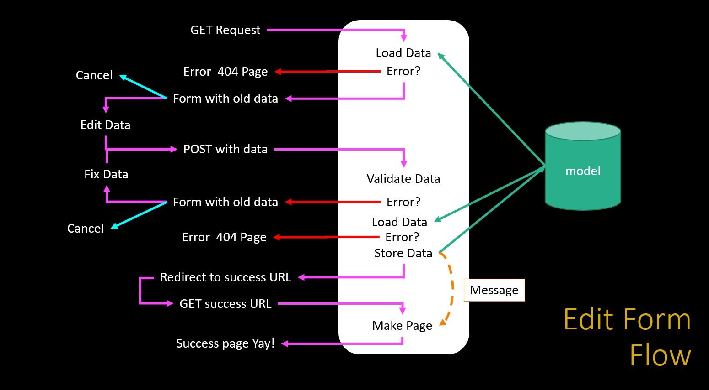

- [Forms](#forms)
  - [DJango forms utility](#django-forms-utility)
  - [Dumping a form objects](#dumping-a-form-objects)
  - [form in a template](#form-in-a-template)

# Forms

Forms is something standard in html, browser, etc. but in django are widely used for many things and the frameworks help us to manage a complex things in a light weight way.

> Handling forms is a complex business. Consider Django’s admin, where numerous items of data of several different types may need to be prepared for display in a form, rendered as HTML, edited using a convenient interface, returned to the server, validated and cleaned up, and then saved or passed on for further processing. Django’s form functionality can simplify and automate vast portions of this work, and can also do it more securely than most programmers would be able to do in code they wrote themselves.
> 
> Django handles three distinct parts of the work involved in forms:
> * preparing and restructuring data to make it ready for rendering
> * creating HTML forms for the data
> * receiving and processing submitted forms and data from the client
> 
> It is possible to write code that does all of this manually, but Django can take care of it all for you.

[DJango Docs](https://docs.djangoproject.com/en/4.0/topics/forms/#django-s-role-in-forms)

Every form in a bussiness application is complex to manage because has to interact with the database and something can go wrong in so many ways that is natural that happens. Furthermore applying css to every form is something demanding.


> * Create
>   * Produce empty form, check post data for validity, re-display form with errors if necessary, add the data to the database, and redirect the user to a success page with a success message
> * Update
>   * Load old data, form with old data, check post data for validity, re-display form with errors if necessary, update the data to the database, and redirect the user to a success page with a success message
> * Delete
>   * Load old data, produce confirmation page with a POST form, receive the post data, delete the record, and redirect the user to a success page with a success message

The total operation of these are depicted as follow:





## DJango forms utility

DJango uses a special way to manage forms that helps a lot. They can do a many things like validate, update, delete, manage data bases in easy way. You even not need to use html at all. But is necessary to use it a template.

> * Generate the necessary HTML to send to the browser
>   * Allow for consistent look and feel across all the forms in an application
> * Receive the POST data coming back from the browser
> * Validate the incoming POST data and produce HTML for an error screen if necessary
> * Move the data from the form into a model and then store it in the database automatically

[DJango docs](https://docs.djangoproject.com/en/4.0/topics/forms/#django-s-role-in-forms)

Now lets to view how to use the forms of django. This modules help us to do many thing directly in pyhon. We can validate easily the data and django forms even can recognize the datatype.
The forms are grouped in  file and can be reused.

```python
# dj4e-samples/form/forms.py

from django import forms
from django.core.exceptions import ValidationError
from django.core import validators

class BasicForm(forms.Form):
    title = forms.CharField(validators=[
        validators.MinLengthValidator(2, "Please enter 2 or more characters")])
    mileage = forms.IntegerField()
    purchase_date = forms.DateField()

```


## Dumping a form objects

For repidly view what the forms object do. Lets only dumnp the dasta in one response but you must to be aware this is only tho review the code generated because the correct way to use it is in a template.


The form:
```python
# dj4e-samples/form/forms.py

class BasicForm(forms.Form):
    title = forms.CharField(validators=[
      validators.MinLengthValidator(2, "...")])
    mileage = forms.IntegerField()
    purchase_date = forms.DateField()

```

The view:
```python
# dj4e-samples/form/views.py

from form.forms import BasicForm

def example(request) :
    form = BasicForm()
    return HttpResponse(form.as_table())

```

The dump data generated by the view (form):
```html
<!-- https://samples.dj4e.com/form/example -->

<tr><th>
<label for="id_title">Title:</label></th>
<td><input type="text" name="title"
required id="id_title"></td></tr>
<tr><th>
<label for="id_mileage">Mileage:</label>
</th><td>
<input type="number" name="mileage" required id="id_mileage">
</td></tr>
<tr><th>
<label for="id_purchase_date">
Purchase date:</label>
</th><td>
<input type="text" name="purchase_date"
required id="id_purchase_date">
</td></tr>

```

## form in a template

The correct way to use the form is in a template.

```html
<!-- dj4e-samples/form/templates/form/form.html -->

<p>
  <form action="" method="post">
    
    <table>
    {{ form.as_table }}
    </table>
    <input type="submit" value="Submit">
    <input type="submit" 
    onclick="window.location='' ; return false;"
    value="Cancel">
  </form>
</p>

```

Sometimes is necessary to put old data in the form to render it with the form before hand. This data is provided in the contruct method as a dictionary.

```python
# dj4e-samples/form/views.py

class SimpleUpdate(DumpPostView):
    def get(self, request) :
        old_data = {
            'title': 'SakaiCar',
            'mileage' : 42,
            'purchase_date': '2018-08-14'
        }
        form = BasicForm(old_data)
        ctx = {'form' : form}
        return render(request, 'form/form.html', ctx)

```


