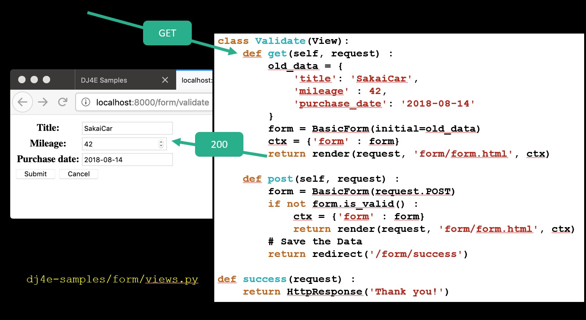
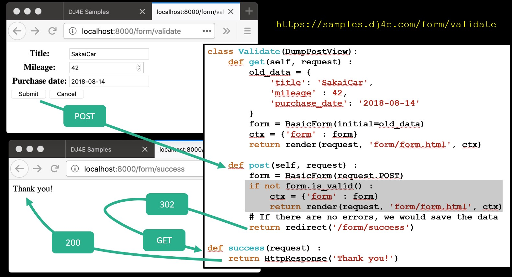
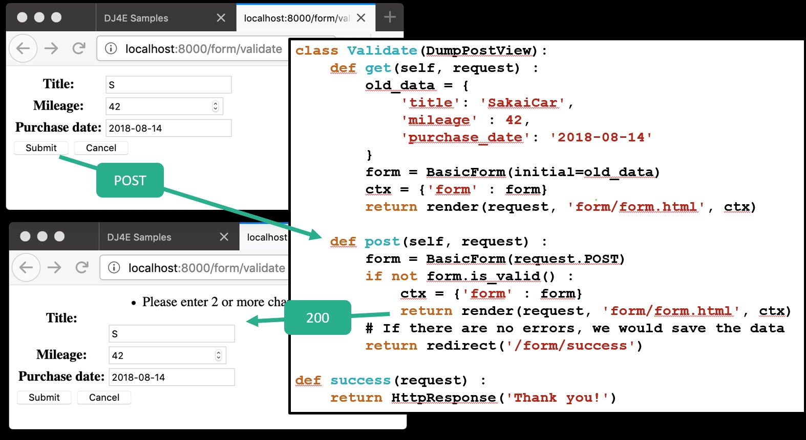

- [DJango forms to DRY(dont repeat yourself)](#django-forms-to-drydont-repeat-yourself)
  - [what can a form do](#what-can-a-form-do)
  - [Basic form](#basic-form)
  - [Dumping a form object](#dumping-a-form-object)
  - [How to integrate a form in a template](#how-to-integrate-a-form-in-a-template)
  - [pulling out data into existing form](#pulling-out-data-into-existing-form)
- [Data Validation](#data-validation)


# DJango forms to DRY(dont repeat yourself)

> Handling forms is a complex business. Consider Django’s admin, where numerous items of data of several different types may need to be prepared for display in a form, rendered as HTML, edited using a convenient interface, returned to the server, validated and cleaned up, and then saved or passed on for further processing. Django’s form functionality can simplify and automate vast portions of this work, and can also do it more securely than most programmers would be able to do in code they wrote themselves.
> 
> Django handles three distinct parts of the work involved in forms:
> * preparing and restructuring data to make it ready for rendering
> * creating HTML forms for the data
> * receiving and processing submitted forms and data from the client
> 
> It is possible to write code that does all of this manually, but Django can take care of it all for you.
>

[DJango docs](https://docs.djangoproject.com/en/4.0/topics/forms/#django-s-role-in-forms)

Create and mange CRUD is complex process but the forms in django helps a lot on this topic.

* Create
  * Produce empty form, check post data for validity, re-display form with errors if necessary, add the data to the database, and redirect the user to a success page with a success message
* Update
  * Load old data, form with old data, check post data for validity, re-display form with errors if necessary, update the data to the database, and redirect the user to a success page with a success message
* Delete
  * Load old data, produce confirmation page with a POST form, receive the post data, delete the record, and redirect the user to a success page with a success message


## what can a form do

* Generate the necessary HTML to send to the browser
  * Allow for consistent look and feel across all the forms in an application
* Receive the POST data coming back from the browser
* Validate the incoming POST data and produce HTML for an error screen if necessary
* Move the data from the form into a model and then store it in the database automatically

[DJango Docs](https://docs.djangoproject.com/en/4.0/topics/forms/#django-s-role-in-forms)

## Basic form

```python
# dj4e-samples/form/forms.py

from django import forms
from django.core.exceptions import ValidationError
from django.core import validators

class BasicForm(forms.Form):
    title = forms.CharField(validators=[
        validators.MinLengthValidator(2, "Please enter 2 or more characters")])
    mileage = forms.IntegerField()
    purchase_date = forms.DateField()

```

## Dumping a form object

```python
# dj4e-samples/form/forms.py

class BasicForm(forms.Form):
    title = forms.CharField(validators=[
      validators.MinLengthValidator(2, "...")])
    mileage = forms.IntegerField()
    purchase_date = forms.DateField()
```

```python
# dj4e-samples/form/views.py

from form.forms import BasicForm

def example(request) :
    form = BasicForm()
    return HttpResponse(form.as_table())
```
The output will render the form to html with all the requiremts esily for you. This avoid to much work creating the html interface by yourself.
```html
<!-- https://samples.dj4e.com/form/example -->

<tr><th>
<label for="id_title">Title:</label></th>
<td><input type="text" name="title"
required id="id_title"></td></tr>
<tr><th>
<label for="id_mileage">Mileage:</label>
</th><td>
<input type="number" name="mileage" required id="id_mileage">
</td></tr>
<tr><th>
<label for="id_purchase_date">
Purchase date:</label>
</th><td>
<input type="text" name="purchase_date"
required id="id_purchase_date">
</td></tr>

```

## How to integrate a form in a template 
```html
<!-- dj4e-samples/form/templates/form/form.html -->

<p>
  <form action="" method="post">
    
    <table>
    {{ form.as_table }}
    </table>
    <input type="submit" value="Submit">
    <input type="submit" 
    onclick="window.location='' ; return false;"
    value="Cancel">
  </form>
</p>

```

```python
# dj4e-samples/form/views.py

class SimpleCreate(DumpPostView):
    def get(self, request) :
        form = BasicForm()
        ctx = {'form' : form}
        return render(request, 'form/form.html', ctx)

```

## pulling out data into existing form

Sometimes put data in the form and later render it. This could be done too with the capabilities of DJango forms:


```python
# dj4e-samples/form/views.py

class SimpleUpdate(DumpPostView):
    def get(self, request) :
        old_data = {
            'title': 'SakaiCar',
            'mileage' : 42,
            'purchase_date': '2018-08-14'
        }
        form = BasicForm(old_data)
        ctx = {'form' : form}
        return render(request, 'form/form.html', ctx)

```

# Data Validation

Always is necessary to do data validation. This could be done with the provided tools of DJango.

```python
# dj4e-samples/form/forms.py

class BasicForm(forms.Form):
    title = forms.CharField(validators=[
      validators.MinLengthValidator(2, "Please enter 2 or more characters")
    ])
    mileage = forms.IntegerField()
    purchase_date = forms.DateField()

```

The first step to to obtain the form to change the data


The second step consist in change the data, the validation phase is tested in `if not  form.is_valid()` to determine if save the data or send a erorr. Something curious here is that if the change is done you will return an redirection and `200` otherwise.




