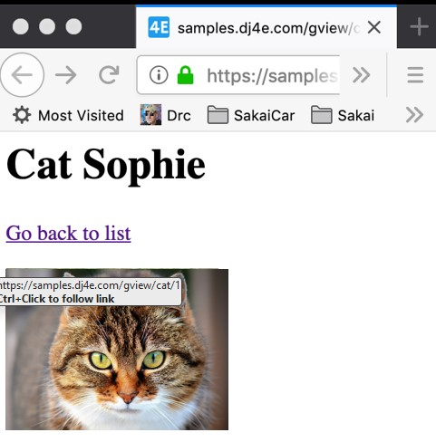

# Generic views

The all ideas behind generic view is to use DRY (not repeat yourself). Is to use generic views provided for DJango to manage basic things like listing object of database and so on. This  allows to make a view with onli 2 lines of code!.

Django can identify what some of the view more used among web pages implementations:
> Writing Web applications can be monotonous, because we repeat certain patterns again and again.  Django’s generic views were developed to ease that pain. They take certain common idioms and patterns found in view development and abstract them so that you can quickly write common views of data without having to write too much repetitive code.
> 
> We can recognize certain common tasks, like displaying a list of model objects, and write code that displays a list of any model object.  Django ships with generic views to display list and detail pages for a single model object. 

[DJango Docs](https://docs.djangoproject.com/en/4.0/topics/class-based-views/generic-display/)

 
This is the concept of convention over  configuration:

>Convention over configuration is a software design paradigm used by software frameworks that attempts to decrease the number of decisions that a developer using the framework is required to make without necessarily losing flexibility. 
>
>When the convention matches the desired behavior, it behaves as expected without having to write configuration files. Only when the desired behavior deviates from the implemented convention is explicit configuration required. 

[wiki info](https://en.wikipedia.org/wiki/Convention_over_configuration)

To use a DJango generic view you must first read all the documentation about it. Or maybe you will find a lot errors in your implementation.

## Generic list view in DJango
*If
    * If the app_name is `gview`
    * And the view extends `django.views.generic.list.ListView`
    * And the view uses the model `Horse`
* Then
    * The will automatically render a view named `gview/horse_list.html`
    * Passing a list of `Horse` objects in the variable `horse_list` into the template

To view the differences is necessary to review the differences between a generic class and other is not.

### An example of not generic view

This is the example of not using generic views.

```html
<!-- dj4e-samples/gview/templates/gview/cat_detail.html -->

<h1>Cat {{ cat.name }}</h1>
<p>
<a href="">Go back to list</a>
</p>
<p>

</p>

```

```python
# dj4e-samples/gview/views.py

class CatDetailView(View):
    def get(self, request, pk_from_url) :
        obj = Cat.objects.get(pk=pk_from_url)
        cntx = { 'cat': obj }
        return render(request, 'gview/cat_detail.html', cntx)
```

request

```
https://samples.dj4e.com/gview/cat/1

```


## Example of generic view

This is an example how to make the same with generic code. We have less lines here. 

```python
# dj4e-samples/gview/views.py

from django.views import generic

class HorseListView(generic.ListView):
    model = Horse

```
```html
<!-- dj4e-samples/gview/templates/gview/horse_list.html -->

<h1>Horse List</h1>
<p>

<ul>
  
    <li>
      <a href="">{{ horse.name }}</a>
    </li>
  
</ul>

  <p>There are no horses in the database.</p>

</p>

```

```
https://samples.dj4e.com/gview/horses
```


