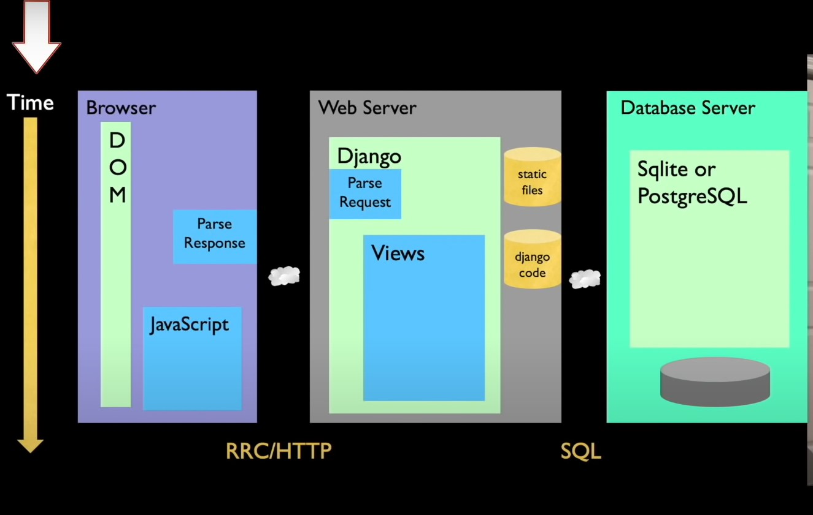
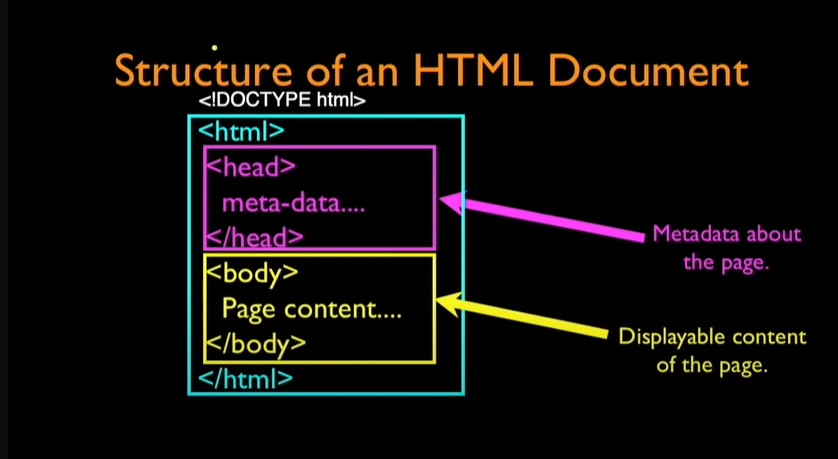
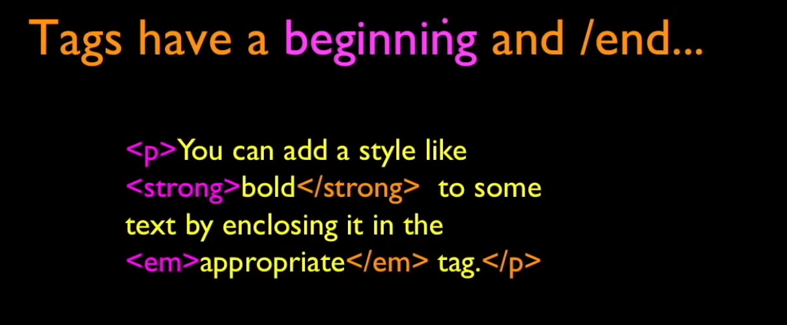
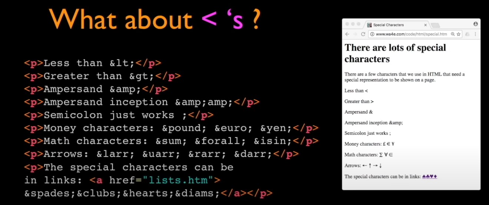
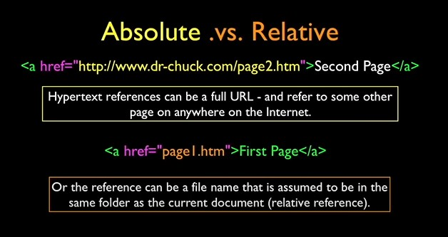
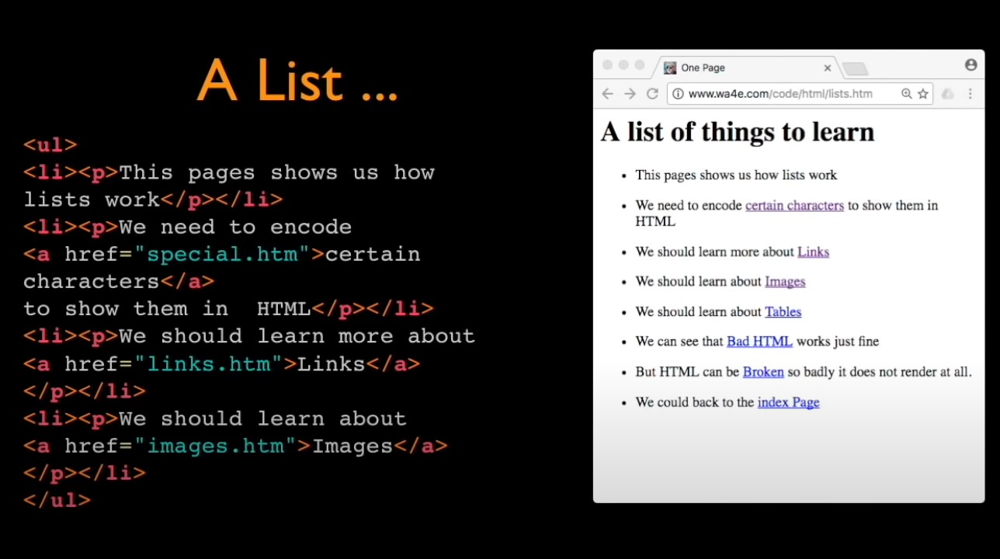
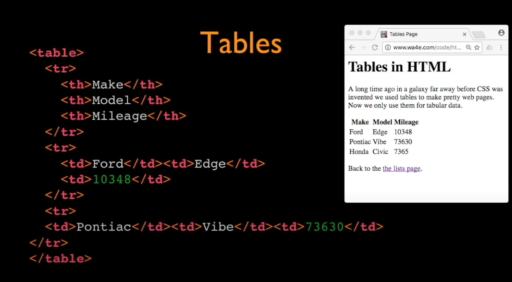

# HTML

- [HTML](#html)
- [Introduction](#introduction)
    - [Special File Names](#special-file-names)
    - [tags](#tags)
    - [special characters (scaping characters)](#special-characters-scaping-characters)
    - [comentaries](#comentaries)
    - [Links](#links)
    - [List](#list)
    - [Tables](#tables)

# Introduction
This topic is boarded in the context of Django and the our app development.



In tnis part lets to focus in the resonse that the browser recives to display our htlm page. So will we focus in the fist part in the view.

So basicaly  HTML is:

* A way of marking up text to indicate that some text is different than other text.
* we "tag" portions of the text to communicate meaning.

Mainly in the first years there was no standard to write proper html code, so you could write anything you want but this was a problem to make all the vendor provide browsers. For this reason was necessary to craete the standard to be able to control how a page is rendered and build. So today we have a free and universal standart used by every one.



### Special File Names

* When a URL points to a diretory in your web server, it looks for file with a special name:
  * index.html
  * index.htm
  * index.php
  * etc
* While there are a convention, the "default file" is configurable - so nothing is "sure".
* Usually use index.html or index.htm is safe bet
* This only work when viewving throught a web server, when you see through disk you must to view the file.

We can have multiple files in one dir and linked together through relative links.

### tags

Returning to html exits tags to define how the browser will render the objects. There ara plenty to diverse type of content but almost every tag follow this rule: a opening tag musht to have a close tag there are exception like self closing tags:



### special characters (scaping characters)

Like almost all languages we use symbos that are to special use to the languages but somethig we need to use that symbols in our text to display for that reason is necessary to use a character o secuence of charaters to do so:



so in html the special characters can be displayed with a prefix `&` and then the command that represetn that symbol. 

### comentaries

The commentaries in html can be done with:
```html
<!-- This is commentary -->
```

### Links

* One of the key things about HTML is making a set of pages and making " hypertext" links amongst those pages.
* links are waht make the " web" a " web" - it is a web interlinked documents.
* The interlinked nature of the web leads to the "knowledge" the search engines like Google appear to have "intelligence".

one the most important tag is the anchor tag.

```html
<a href="www.something"></a>
```


### List

The list are important and the syntax is the following:



### Tables
The tables are very useful to use it to display information:

