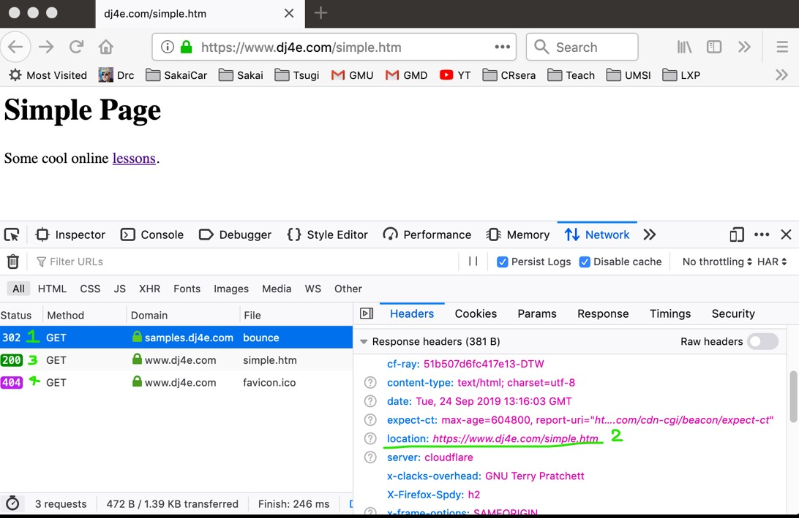

# Index
- [Index](#index)
- [html codes](#html-codes)
  - [Redirec code 302 (HTTP Location Header)](#redirec-code-302-http-location-header)

# html codes


There are multiple codes in the html protocol that help to know how to treat a request or resonse. You can program how to interact with it based on this codes.

* http://www.dr-chuck.com/page1.htm - 200 OK
* http://www.dj4e.com/nowhere.htm - 404 Not Found
* 500 Server Error
* http://www.drchuck.com/ - 302 Found / Moved
  * Also known as “redirect”

## Redirec code 302 (HTTP Location Header)

* You can send a "Redirect" response instead of a page response to communicate a "Location:" header to the browser
* The location header includes a URL that the browser is supposed to forward itself to.
* It was originally used for web sites that moved from one URL to another.

Currently this code is used as part of the controller part. With this we can redirect to a user to a next step in our page flow.

Example of using a redirect:

```
https://samples.dj4e.com/views/bounce 
```

```python
 path('bounce', views.bounce)
```

```python
#views.py
from django.http import HttpResponse
from django.http import HttpResponseRedirect

# This is a command to the browser
def bounce(request) :
    return HttpResponseRedirect('https://www.dj4e.com/simple.htm')

```

[DJango response docs](https://docs.djangoproject.com/en/4.0/ref/request-response/#django.http.HttpResponseRedirect)



1. The first request gets a 302 code.
2. Inside of the previous response we can see new location to go.
3. The second response is made to the new page and receive a new page (200 OK).
4. This new page doesn't have a favicon (image to use in bar of web browser)
