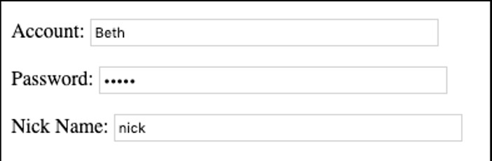
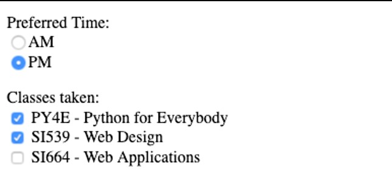
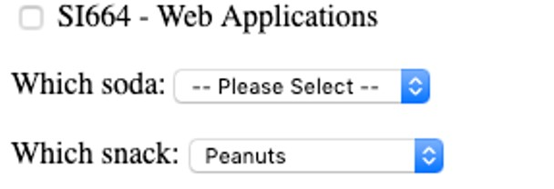
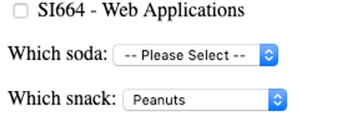
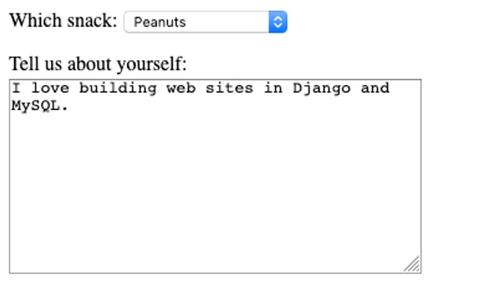
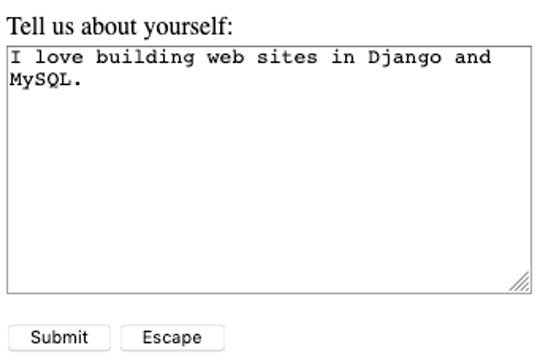

# HTML imputs

* Text
* Password
* Radio Button
* Check Box
* Select / Drop-Down
* Textarea

## Basic inputs
```html
<p>Many field types...</p>
<form method="post">
   <p><label for="inp01">Account:</label>
   <input type="text" name="account" id="inp01" size="40" ></p>
   <p><label for="inp02">Password:</label>
   <input type="password" name="pw" id="inp02" size="40" ></p>
   <p><label for="inp03">Nick Name:</label>
   <input type="text" name="nick" id="inp03" size="40" ></p>
```
```html

Incoming POST data:
account=Beth
pw=12345
nick=nick
when=pm
...


```
## Checkbox
```html
<p>Classes taken:<br/>
    <input type="checkbox" name="class1">
        PY4E - Python for Everybody<br>
    <input type="checkbox" name="class2" value="si539" checked>
        SI539 - Web Design<br>
    <input type="checkbox" name="class3" value="si664">
        SI664 - Web Applications<br>
</p>

```
```
Incoming POST data:
...
when=pm
class1=on
class2=si539
...
```


## List

```html
   <p><label for="inp06">Which soda:
    <select name="soda" id="inp06">
      <option value="0">-- Please Select --</option>
      <option value="1">Coke</option>
      <option value="2">Pepsi</option>
      <option value="3">Mountain Dew</option>
      <option value="4">Orange Juice</option>
      <option value="5">Lemonade</option>
    </select>
   </p>

```
```
Incoming POST data:
...
soda=0
snack=peanuts
...

```


### with string


```html
<p><label for="inp07">Which snack:
   <select name="snack" id="inp07">
     <option value="">-- Please Select --</option>
     <option value="chips">Chips</option>
     <option value="peanuts" selected>Peanuts</option>
     <option value="cookie">Cookie</option>
   </select>
 </p>

```
```
Incoming POST data:
...
soda=0
snack=peanuts
...

```


## Text box
```html
<p><label for="inp08">Tell us about yourself:<br/>
  <textarea rows="10" cols="40" id="inp08" name="about">
    I love building web sites in Django and MySQL.
  </textarea>
</p>

```
```
Incoming POST data:
...
snack=peanuts
about=I love building web sites in Django and MySQL. 
dopost=Submit

```


# Escape button (clean all don't send information)

```html
<input type="submit" name="dopost" value="Submit"/>
<input type="button"
  onclick="location.href='http://www.dj4e.com/'; return false;"
  value="Escape">

```

```
Incoming POST data:
...
snack=peanuts
about=I love building web sites in Django and MySQL. 
dopost=Submit

```


# HTML5 new inputs

With html 5 there are new input formats. This kind of input make a data validation before to send the information. But are not supported by all the browsers. The validation happens when you press the submit button.

```html
Select your favorite color: 
<input type="color" name="favcolor" value="#0000ff"><br/>

Birthday: 
<input type="date" name="bday" value="2003-09-02"><br/>

E-mail: 
<input type="email" name="email"><br/>

Quantity (between 1 and 5): 
<input type="number" name="quantity" 
   min="1" max="5"><br/>

Add your homepage: 
<input type="url" name="homepage"><br>

Transportation: 
<input type="flying" name="saucer"><br>
```


