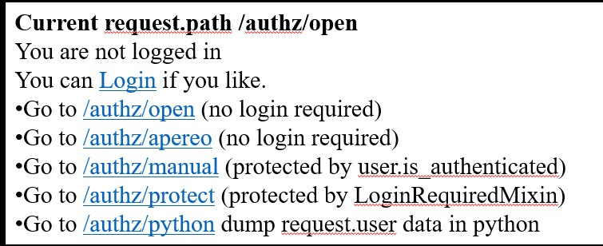
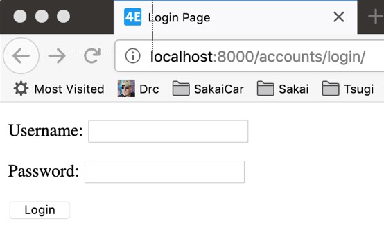

# Index

- [Index](#index)
- [Session are not loging](#session-are-not-loging)
- [Django loging functionality](#django-loging-functionality)
  - [Reversing views witha outh](#reversing-views-witha-outh)
  - [Redirecting users](#redirecting-users)
    - [Exaples](#exaples)
    - [Using loging in the templates](#using-loging-in-the-templates)
  - [Look and feel](#look-and-feel)
  - [Using the data of the login interface](#using-the-data-of-the-login-interface)
    - [Template](#template)
    - [python](#python)
    - [Views that require a logged in user](#views-that-require-a-logged-in-user)


# Session are not loging

* A session is a way of marking a browser  and storing data on the server which can be stored and retrieved across multiple request-response-cycles
* Sessions exist irrespective of whether or not the user is logged in
* When the user passes the login check, the server adds data to the session identifying the user
* When the user logs out, that information in the session is removed
  
* Sessions are required to implement login

# Django loging functionality

* Login functionality is built into Django and included in your settings.py by default

To be able is only necessary to do this configuarion:

```python
#dj4e-samples/dj4e-samples/urls.py

INSTALLED_APPS = [
    'django.contrib.admin',
    'django.contrib.auth',
    'django.contrib.contenttypes',
...

```
[DJango docs](https://docs.djangoproject.com/en/4.0/topics/auth/default)


## Reversing views witha outh

To see the full route to use with loging we can use the `reverse()` utility function contained in `django.urls` module.

```python
#dj4e-samples/authz/views.py

from django.urls import reverse

class DumpPython(View) :
    def get(self, req):
        resp = "<pre>\nUser Data in Python:\n\n"
        resp += "Login url: " + reverse('login') + "\n"
        resp += "Logout url: " + reverse('logout') + "\n\n"

```

```
https://samples.dj4e.com/authz/python

User Data in Python:

Login url: /accounts/login/
Logout url: /accounts/logout/

```

## Redirecting users

Sometimes is necessary to redirect a user to another page after the loging step. This is done through a special syntax.

* We want to transfer the user to a login page from many pages in our application and when they successfully log in, we want to bring them back to our page or some other page
* The "next=" parameter tells login or logout  where to **redirect** the user after login

### Exaples

in the next path are examples to use the redirect section. Every url patter uses a name to be able to use reversion the url for the use with templates.

```python
#dj4e-samples/authz/urls.py

urlpatterns = [
    path('', TemplateView.as_view(template_name='authz/main.html')),
    path('open', views.OpenView.as_view(), name='open'),
    path('apereo', views.ApereoView.as_view(), name='apereo'),
    path('manual', views.ManualProtect.as_view(), name='manual'),
    path('protect', views.ProtectView.as_view(), name='protect'),
    path('python', views.DumpPython.as_view(), name='python'),
]

```
This only a representation of all the link to use the url resolution is `{appname:view2use}`:

```html
<li>
        Go to <a href=""></a>
            (no login required)
    </li>
    <li>
        Go to <a href=""></a>
            (no login required)
    </li>
    <li>
        Go to <a href=""></a>
            (protected by user.is_authenticated)
    </li>
    <li>
        Go to <a href=""></a>
            (protected by LoginRequiredMixin)
    </li>
    <li>
        Go to <a href=""></a>
            dump request.user data in python
    </li>

```

The templates in django can use special code to rapidly resolve special routes or elements like: `{{reques.path}}` to be used to identify where was a user before the autentication phase to redirect him later to it. After will we addressed the use of this special variables.


```html
<h1>Current request.path {{ request.path }}</h1>

<p>Authenticated as
<pre>
Name: {{ user.get_full_name }}
Email: {{ user.email }}
Id: {{ user.id }}
</pre>
</p>
<p>You can <a href="?next=">Logout</a></p>

<p>You are not logged in</p>
<p>You can <a href="?next={{ request.path }}">Login</a> if you like.</p>


```

### Using loging in the templates

The use in the templates is like this:

```html
<!-- dj4e-samples/authz/templates/authz/main.html -->

<p>You can <a href="?next={{ request.path }}">
Login</a> if you like.</p>

```



**Note**: When loging out, make sure to set next to a url that does not require login. If you do – the user will be in a frustrating logout / login loop.

## Look and feel

DJango uses a special route to use the login interface. In this route is necessary to stablish a template for this use. 

* To allow us to control the look and feel of the login page we must provide a template called "registration/login.html"
* Django describes what needs to be in this template
* We can put this in any of our application templates folders

The `registration/login.html` ban be put in any app becuase the templates are globally accesible.

[DJango login](https://docs.djangoproject.com/en/4.0/topics/auth/default/#django.contrib.auth.views.LoginView)

The basic login has to have some things in. Like the token for csrf and the `form.as_p` this templete part gives the necessary field to use the login interface then  is necessary to use an input *hidden* with the value *next* to redirect page.

```html
<!-- dj4e-samples/home/templates/registration/login.html -->

<html>
    <title>Login Page</title>
</head>
<body>
<form method="post" action="">

{{ form.as_p }}
<input type="submit" class="btn btn-primary" value="Login" />
<input type="hidden" name="next" value="{{ next }}" />
</form>
</body>
```

```
https://samples.dj4e.com/accounts/login

```


## Using the data of the login interface

Sometimes is necessary to use the data in the login interface. Is easy to access to this data in the template as the code this is  done like these methods:

### Template

```html

<p>Authenticated as
<pre>
Name: {{ user.get_full_name }}
Email: {{ user.email }}
Id: {{ user.id }}
</pre>
</p>

<p>You are not logged in</p>


```

### python

```python
class DumpPython(View) :
    def get(self, req):
        resp = "<pre>\nUser Data in Python:\n\n"
        resp += "Login url: " + reverse('login') + "\n"
        resp += "Logout url: " + reverse('logout') + "\n\n"
        if req.user.is_authenticated:
            resp += "User: " + req.user.username + "\n"
            resp += "Email: " + req.user.email + "\n"
        else:
            resp += "User is not logged in\n"

        resp += "\n"
        resp += "</pre>\n"
        resp += """<a href="/authz">Go back</a>"""
        return HttpResponse(resp)

```

### Views that require a logged in user


* Many of your views need to make sure that someone is logged in before performing some operation that depends on the request.user data being set
  * request.user.id
  * request.user.email
* You could check user.is_authenticated at the beginning of each view and if the user is not logged, redirect them to reverse('login') with the appropriate next= parameter 


[DJango docs](https://docs.djangoproject.com/en/4.0/topics/auth/default/#the-loginrequired-mixin)

Sometimes is necessary to have control access. This is easily done sub clsssing `LoginRequiredMixin`. In the next scrip we offer an example without the use of this class and next the example of the use the proper class this make all the work for us in one line of code.


```python

from django.utils.http import urlencode

class ManualProtect(View) :
    def get(self, request):
        if not request.user.is_authenticated :
            loginurl = reverse('login')+'?'+urlencode({'next': request.path})
            return redirect(loginurl)
        return render(request, 'authz/main.html')


from django.contrib.auth.mixins import LoginRequiredMixin

class ProtectView(LoginRequiredMixin, View) :
    def get(self, request):
        return render(request, 'authz/main.html')

```

[DJango Docs](https://docs.djangoproject.com/en/4.0/topics/auth/default/#the-loginrequired-mixin)

The template to use is like this like all others used in the this documentation.

```html
<h1>Current request.path {{ request.path }}</h1>

<p>Authenticated as
<pre>
Name: {{ user.get_full_name }}
Email: {{ user.email }}
Id: {{ user.id }}
</pre>
</p>
<p>You can <a href="?next=">Logout</a></p>

<p>You are not logged in</p>
<p>You can <a href="?next={{ request.path }}">Login</a> if you like.</p>


```