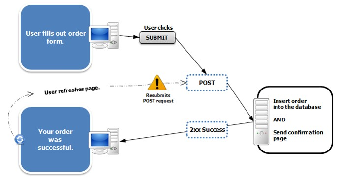
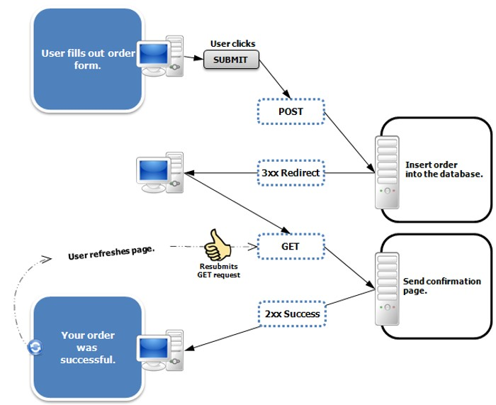
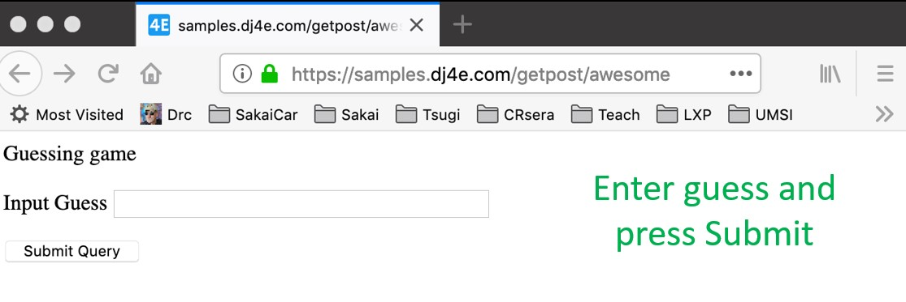
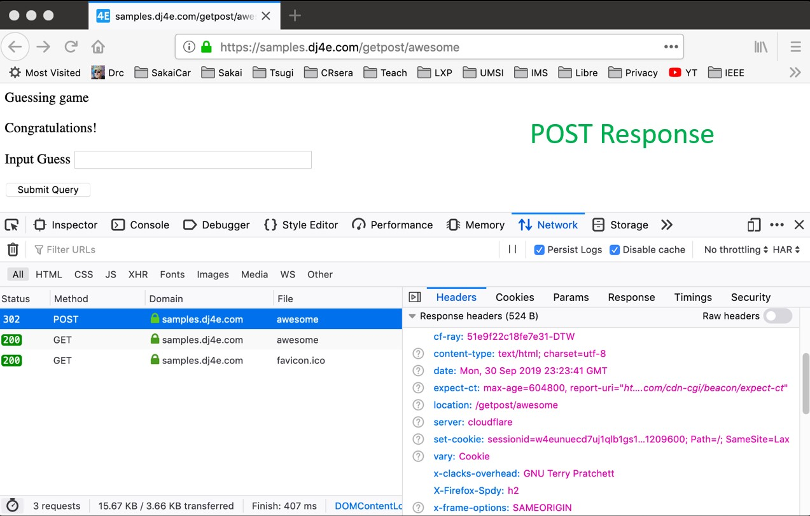
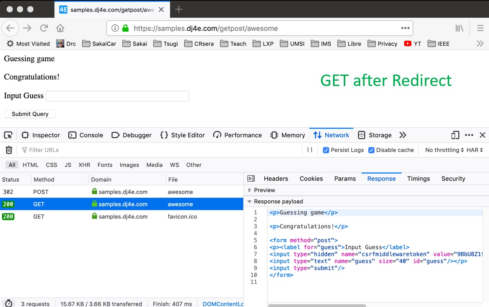

# Index

- [Index](#index)
- [Post-Refresh Pattern](#post-refresh-pattern)
- [Avoid Post-Refreh with Post-Redirect-Get-Refresh](#avoid-post-refreh-with-post-redirect-get-refresh)
  - [Post Redirect Rule](#post-redirect-rule)
  - [redirection of a post](#redirection-of-a-post)

# Post-Refresh Pattern

There are a problem with `POST` request once it's done return a 200 html code. After, if you refresh the page the browser will re send the same `POST` request. This is bad because this can be an operation that alter the database and if you are talking about money this is something serious. The browser try to avoid this showing a messasge before to do so but this prune to error. The client that doesn't know anything about web development and probably just will ignore the message.


# Avoid Post-Refreh with Post-Redirect-Get-Refresh

## Post Redirect Rule

* The simple rule for pages intended for a browser is to never generate a page with HTML content when the app receives POST data and data has been modified
* Must cause a GET by redirecting somewhere - even a GET to  the same URL- forcing the browser to make a GET after the POST

So the rules are basically if you have a post and you introduce data to it or send data and send it, you must redirect the brower to a get method. That's all.

```
http://www.dr-chuck.com/page1.htm - 200 OK

https://samples.dj4e.com/getpost/failform - 403 Forbidden
Post data without CSRF Token

http://www.wa4e.com/nowhere.htm - 404 Not Found

http://www.drchuck.com/ - 302 Found / Moved
  Also known as “redirect”
```

This is a bad implementation of the post method, because is not redirect to a `GET` method.



This a good implementation:




```python
# dj4e-samples/getpost/views.py

class AwesomeView(View) :
    def get(self, request):
        msg = request.session.get('msg', False)
        if ( msg ) : del(request.session['msg'])
        return render(request, 'getpost/guess.html', {'message' : msg })

    def post(self, request):
        guess = request.POST.get('guess')
        msg = checkguess(guess)
        request.session['msg'] = msg
        return redirect(request.path)


```

To see more detail about this is necessary to know about session and cookies.


```html
<!-- dj4e-samples/getpost/templates/getpost/guess.html -->

<p>Guessing game</p>

<p>{{ message }}</p>

<form method="post">
<p><label for="guess">Input Guess</label>

<input type="text" name="guess" size="40" id="guess"/></p>
<input type="submit"/>
</form>

```






## redirection of a post

* Pass data to the GET – "flash message pattern"
* Session can be used for flash messages


```python
# dj4e-samples/getpost/views.py

class AwesomeView(View) :
    def get(self, request):
        msg = request.session.get('msg', False)
        if ( msg ) : del(request.session['msg'])
        return render(request, 'getpost/guess.html', {'message' : msg })

    def post(self, request):
        guess = request.POST.get('guess')
        msg = checkguess(guess)
        request.session['msg'] = msg
        return redirect(request.path)

```


