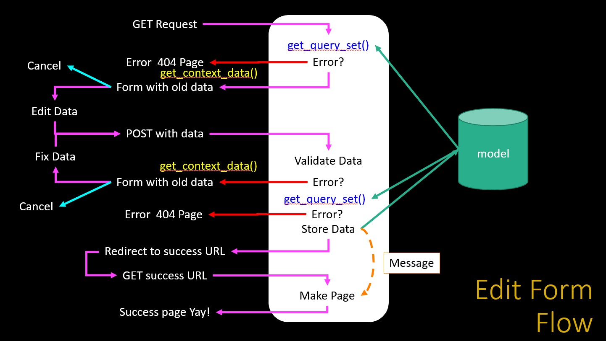

# Editing rows

Usually when we recover the data from the database we recover all the data to avoid this is and only show the data by user logged is necessary to filter the data by the user.

First lets to show a generic list of elements witout this capability:

```python
# dj4e-samples/gview/views.py

from django.views import generic
from gview.models import Horse

class HorseListView(generic.ListView):
    model = Horse

```

```html
<!-- dj4e-samples/gview/templates/gview/horse_list.html -->

<h1>Horse List</h1>
<p>

<ul>
  
    <li>
      <a href="">
         {{ horse.name }}</a>
    </li>
  
</ul>

  <p>There are no horses in the database.</p>

</p>

```
The next script represent the same code but this code can fielter by user. This code uses a modification from the original `generic.ListView`.

```python
# dj4e-samples/myarts/views.py

from myarts.models import Article
from myarts.owner import OwnerListView # This is the our subclass

class ArticleListView(OwnerListView):
    model = Article
```

```html
<!-- dj4e-samples/myarts/templates/myarts/article_list.html -->

<ul>

<li>
<a href="">
   {{ article.title }}</a>

(<a href="">
   Edit</a> |
<a href="">
   Delete</a>)

</li>

</ul>
```

## Modification of `ListView`

Is necessary to know how DJango uses a class and all the convention to modify it. 

> class django.views.generic.list.ListView
> 
> A page representing a list of objects. While this view is executing, self.object_list will contain the list of objects (usually, but not necessarily a queryset) that the view is operating upon.
> 
> Method Flowchart
> *  setup()
> *  dispatch()
> *  http_method_not_allowed()
> *  get_template_names()
> *  get_queryset()
> *  get_context_object_name()
> *  get_context_data()	
> *  get()
> *  render_to_response()

The process is depected here:



In the next secction with this information lets to modify the `ListView` to use it to filter the data by owner logged. This showing how can we messed up with the modifications using one model or another and Django won't complain about it.
 
```python
# dj4e-samples/gview/views.py

# Lets explore how (badly) we can override things...
class WackyEquinesView(generic.ListView):
    model = Car
    template_name = 'gview/wacky.html'

    def get_queryset(self, **kwargs):
        crazy = Horse.objects.all()    # Convention: Car
        return crazy

    def get_context_data(self, **kwargs):
        context = super().get_context_data(**kwargs)
        context['crazy_thing'] = 'CRAZY THING'
        return context
```

```html
<!-- dj4e-samples/gview/templates/gview/wacky.html -->

<h1>List of {{ crazy_thing }}s</h1>
<p>

<ul>
  
    <li>
      <a href="">{{ xyz.name }}</a>
    </li>
  
...

```

### Changing the `ListView` class to use it filter out.

First is necessary to craete the explre the model. Is important to note here the use the Foreignkey here. That table is created by DJango and we can access to it by importing the model.


```python
# dj4e-samples/myarts/models.py

from django.db import models
from django.core.validators import MinLengthValidator
from django.contrib.auth.models import User
from django.conf import settings

class Article(models.Model) :
    title = models.CharField(
            max_length=200,
            validators=[MinLengthValidator(2, "Title must be greater than 2 characters")]
    )
    text = models.TextField()
    # foreignkey to one table of django.
    owner = models.ForeignKey(settings.AUTH_USER_MODEL, on_delete=models.CASCADE)
    created_at = models.DateTimeField(auto_now_add=True)
    updated_at = models.DateTimeField(auto_now=True)

    # Shows up in the admin list
    def __str__(self):
        return self.title

```
Now finally lets to chow how many views we have to make the crud with all the methods altered.


```python
from myarts.models import Article
from myarts.owner import OwnerListView,OwnerDetailView,OwnerCreateView,OwnerUpdateView,OwnerDeleteView

class ArticleListView(OwnerListView):
    model = Article
    # By convention:
    # template_name = "myarts/article_list.html"

class ArticleDetailView(OwnerDetailView):
    model = Article

class ArticleCreateView(OwnerCreateView):
    model = Article
    fields = ['title', 'text']

class ArticleUpdateView(OwnerUpdateView):
    model = Article
    fields = ['title', 'text']

class ArticleDeleteView(OwnerDeleteView):
    model = Article


```

To create a view is necessary to modify some methods related to forms. Becuase this class uses method for to validate data and make another things. In this case lets to change some method to add the user or only limit the scope to the user then chang then call the same method in the superclass and return the values.

> class django.views.generic.edit.ModelFormMixin
> 
> A form mixin that works on ModelForms, rather than a standalone form
> 
> get_success_url()
> Determine the URL to redirect to when the form is successfully validated. Returns success_url if it is provided; otherwise, attempts to use the get_absolute_url() method of the object.
> 
> form_valid(form)
> Saves the form instance, sets the current object for the view, and redirects to get_success_url().
> 
> form_invalid(form)
 > Renders a response, providing the invalid form as context.


```python
# dj4e-samples/myarts/owner.py

from django.views.generic import CreateView, UpdateView, DeleteView, ListView, DetailView
from django.contrib.auth.mixins import LoginRequiredMixin

class OwnerCreateView(LoginRequiredMixin, CreateView):
    """
    Sub-class of the CreateView to automatically pass the Request to the Form
    and add the owner to the saved object.
    """

    # Saves the form instance, sets the current object for the
    # view, and redirects to get_success_url().
    def form_valid(self, form):
        print('form_valid called')
        object = form.save(commit=False)
        object.owner = self.request.user
        object.save()
        return super(OwnerCreateView, self).form_valid(form)


```


```python
# dj4e-samples/myarts/owner.py

from django.views.generic import CreateView, UpdateView, DeleteView, ListView, DetailView
from django.contrib.auth.mixins import LoginRequiredMixin

class OwnerUpdateView(LoginRequiredMixin, UpdateView):
    """
    Sub-class the UpdateView to pass the request to the form and limit the
    queryset to the requesting user.
    """

    def get_queryset(self):
        print('update get_queryset called')
        """ Limit a User to only modifying their own data. """
        qs = super(OwnerUpdateView, self).get_queryset()
        return qs.filter(owner=self.request.user)


```

```python
# dj4e-samples/myarts/views.py

from myarts.models import Article
from myarts.owner import OwnerDeleteView

class ArticleDeleteView(OwnerDeleteView):
    # By convention, template='myarts/article_confirm_delete.html'
    model = Article

```
