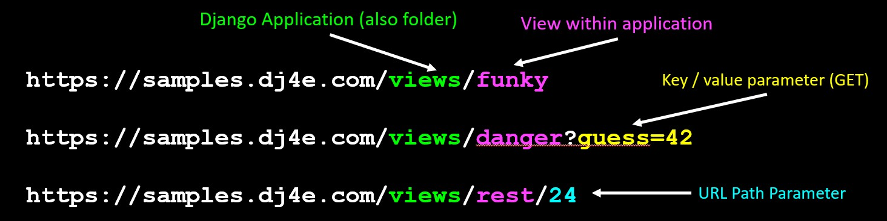
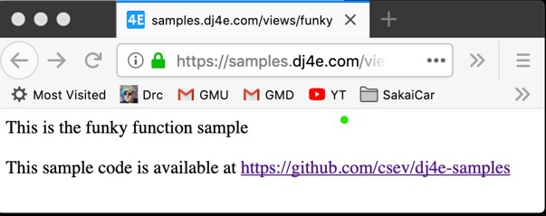
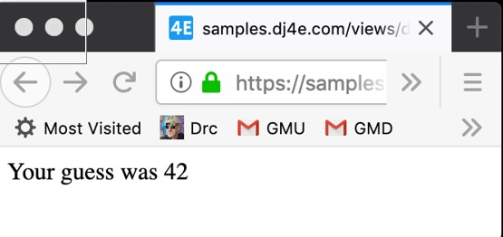

# Views and templates

## index

- [Views and templates](#views-and-templates)
  - [index](#index)
  - [Introduction](#introduction)
  - [Parsing an URL](#parsing-an-url)
    - [URL dispacher (router)](#url-dispacher-router)
      - [Three parameters for views (url.py)](#three-parameters-for-views-urlpy)
  - [Static views (static web page)](#static-views-static-web-page)
  - [Request and response Objects](#request-and-response-objects)
    - [class HttpRequest](#class-httprequest)
  - [class HttpResponse](#class-httpresponse)
  - [Function view example (more sophistacated response)](#function-view-example-more-sophistacated-response)
  - [Function with key-value parameter in the url](#function-with-key-value-parameter-in-the-url)
  - [Url parsing with parameters](#url-parsing-with-parameters)

## Introduction
view are the core of the application


* Django looks at the incoming request URL and uses urls.py to select a view
* The view from views.py
  * Handle any incoming data in the request and copy it to the database through the model
  * Retrieve data to put on the page from the database though the model
  * Produce the HTML that will become the response and return it to the browser

## Parsing an URL

When Django receives an HTTP request it parses it, uses some of the URL for routing purposes and passes parts of the URL to your code



We must to remember that first come the domain of our project ant then the app name (this is a dir inside our projet) after this goes to one view and finally we have two options:

* key/value parameter (GET)
* URL Path paramer old school

### URL dispacher (router)

A clean, elegant URL scheme is an important detail in a high-quality Web application. Django lets you design URLs however you want, with no framework limitations.

To design URLs for an app, you create a Python module informally called a **URLconf** (URL configuration). This module is pure Python code and is a mapping between URL path expressions to Python functions (your views).

This mapping can be as short or as long as needed. It can reference other mappings. And, because it’s pure Python code, it can be constructed dynamically.

[DJango dispacher docs](https://docs.djangoproject.com/en/4.0/topics/http/urls/)

#### Three parameters for views (url.py)

* Requests are routed to a pre-defined class from Django itself
  * This a standard way to manage the resquest takes a url with a certain pattern and routes to class
  
* Requests are routed to a function in **views.py** that takes the http **request** as a parameter and returns a response
  * This is old school and  fucntion that takes all request and manges to deliver a response.
  
* Requests are routed to a class in **views.py** that has  **get()** and **post()** methods that take the http **request** as a parameter and return a response
  
lets to see the three examples:

```python
# views/url.py

from django.urls import path
from . import views
from django.views.generic import TemplateView

# https://docs.djangoproject.com/en/4.0/topics/http/urls/
app_name='views'
urlpatterns = [
    # pre-defined class from Django
    path('', TemplateView.as_view(template_name='views/main.html')),
    # function from views.py
    path('funky', views.funky),
    path('danger', views.danger),
    path('game', views.game),
    path('rest/<int:guess>', views.rest),
    path('bounce', views.bounce),
    # our class from views.py
    path('main', views.MainView.as_view()),
    path('remain/<slug:guess>', views.RestMainView.as_view()),
]

```

The predifined one the '' means the root of the application. `TemplateView.as_view(template_name='views/main.html')` tells to Django to choose a predifined template and return it. 
The middle one is classic way to manage urls. And the third one is use as personalized way to do your class from a file named view.py.

## Static views (static web page)

Taking as this path to resolve a url.
DJango gives us predetermined way to cal templates that are part of Django. 
**Note**: *views* es the name of app created inside our project. So the noraml structure of path to main is `projectname/appname/templates/appname/main.html`. The reason to use again the name of the app inside the `templates` dir is becasue DJango could has multiple `templates` dir with the same name across the apps.

```python
 path('', TemplateView.as_view(template_name='views/main.html'))

```

This is an example of static page. This not read nothing from the database and nothing is changed once interpreted. This response is automatically to the browser with no computation behind. This ideal when manage a static site with no python programation behind.

```html
<html>
    <body>
        <p>This is the views main.html sample</p>

        <p>
            <ul>
                <li>This page is coming from a file in views/templates/main.html</li>
                <li><a href="funky">Use a view function</a></li>
                ...
            </ul>
        </p>

        <p>This sample code is available at
            <a href="https://github.com/csev/dj4e-samples" target="_blank">
            https://github.com/csev/dj4e-samples</a>
        </p>
    </body>
</html>

```

## Request and response Objects

> Django uses request and response objects to pass information throughout your Django application.
> 
> When a page is requested by a browser, Django creates an HttpRequest object that contains metadata about the request. 
> 
> Then Django loads the appropriate view, passing the HttpRequest as the first argument to the view function. Each view is responsible for returning an HttpResponse object.
> 
>  The Application Programming Interfaces (APIs) for HttpRequest and HttpResponse objects, are defined in the django.http module.

[DJango source](https://docs.djangoproject.com/en/4.0/ref/request-response/)

### class HttpRequest

This is the object what we receive in our application to generate the response (view to send to the page). This contain all the information necessary to manage the response.

> **Attributes**
> All attributes should be considered read-only, unless stated otherwise.
> 
> **HttpRequest.scheme**
> A string representing the scheme of the request (http or https usually).
> 
> **HttpRequest.body**
> The raw HTTP request body as a bytestring. This is useful for processing data in different ways than conventional HTML forms: binary images, XML payload etc. For processing conventional form data, use `HttpRequest.POST`.

[DJango Source](https://docs.djangoproject.com/en/4.0/ref/request-response/#django.http.HttpRequest)

## class HttpResponse

> This is the response we sent to the browser to be rendered or somehing more. 
> 
> In contrast to HttpRequest objects, which are created automatically by Django, HttpResponse objects are your responsibility. 
> 
> Each view you write is responsible for instantiating, populating, and returning an HttpResponse.
> 
> Passing strings
> 
> Typical usage is to pass the contents of the page, as a string or bytestring, to the HttpResponse constructor.


[Django docs](https://docs.djangoproject.com/en/4.0/ref/request-response/#django.http.HttpResponse)

## Function view example (more sophistacated response)

This is an example how to do a response through a an fucntion the traditional way to manage a response in web development. In this response we are ignoring the reques object and only returning a static resonse.

Exaple of url request


```
https://samples.dj4e.com/views/funky

```
**Note** Remenber that is domain/appname/function pattern

```python
# how the route is resolve
# Remember that views is a module imported to this python script.
 path('funky', views.funky),

```

```python
from django.http import HttpResponse
from django.http import HttpResponseRedirect

# Create your views here.

def funky(request):
    response = """<html><body><p>This is the funky function sample</p>
    <p>This sample code is available at
    <a href="https://github.com/csev/dj4e-samples">
    https://github.com/csev/dj4e-samples</a></p>
    </body></html>"""
    return HttpResponse(response)
```
Here we are returning a static page.




## Function with key-value parameter in the url 

Sometimes we need to use data that comes in the url response as part our code to give a calculated response:

```
https://samples.dj4e.com/views/danger?guess=42 

```

This is how url dispacher looks like with this kind of request
```python
# views/urls.py
path('danger', views.danger),
```
The `request` is received as the same way before but now we can use the object to retrieve the key value information hold on by the object.

```python
# views/views.py
from django.http import HttpResponse
from django.http import HttpResponseRedirect

# Create your views here.

def danger(request) :
    response = """<html><body>
    <p>Your guess was """+request.GET['guess']+"""</p>
    </body></html>"""
    return HttpResponse(response)
```



## Url parsing with parameters

Here after the app name(views) and view(rest) the next part is passed as value. The kind of value is determined in the next section.

```
https://samples.dj4e.com/views/rest/41 

```

In this file the urls and values are established by the use the `<type:name>` pair as we can see next:

```python
# urls.py
urlpatterns = [
    path('rest/<int:guess>', views.rest),
]
```
In the view (`rest`) the request object is passed as first arguement and the value (`guess`) as second argument.

```python
from django.http import HttpResponse
from django.utils.html import escape

def rest(request, guess) :
    response = """<html><body>
    <p>Your guess was """+escape(guess)+"""</p>
    </body></html>"""
    return HttpResponse(response)
```


