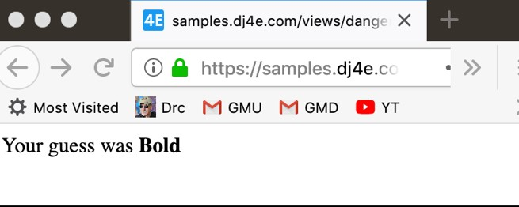
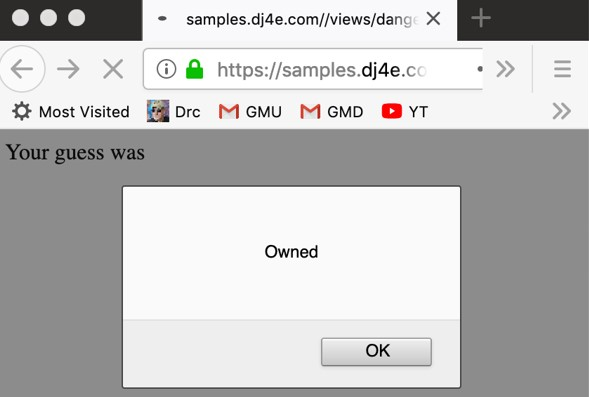

# Cross-site scripting

* It is dangerous to take data from the user and include it in the HTTP Response without "escaping" the output.
* HTML + JavaScript is a programming language and you don't want your users "sending code" to other user's browsers

* Cross-Site Scripting (XSS)
  * https://en.wikipedia.org/wiki/Cross-site_scripting
  * https://en.wikipedia.org/wiki/List_of_XML_and_HTML_character_entity_references
## Examples of Cross SS

Taking the data coming from an user as it is not a good idea becuse the response can hide malicious code. In the next images we can see that the value part of url-request has encoded html symbols that after are rendered by the dom of ther user that recieves this reponse. Note that this response can be saved in the database and not necessary the user who write it will receive it. We can even put javascript there and take control of web brower of another person.

### basic exmple

Malicous url-request with encoded htlm symbols

```
https://samples.dj4e.com/views/danger?guess=%3Cb%3EBold%3C%2Fb%3E 
```
Function that takes the key values pair and use it the response dictiionary to get `GET['guess']`.

```python
def danger(request) :
    response = """<html><body>
    <p>Your guess was """+request.GET['guess']+"""</p>
    </body></html>"""
    return HttpResponse(response)

```
respose after the processing.

```html
<html><body>
<p>Your guess was <b>Bold</b></p>
</body></html>

```

Response rendered



### JS example

Note that this scrip rendered in html now is incrusting an Javascript  code this is serious problem is we let as is.
```
https://samples.dj4e.com/views/danger?guess=%3Cscript%3Ealert%28%27Owned%27%29%3B%3C%2Fscript%3E

```

```html
<html><body>
<p>Your guess was <script>alert('Owned');</script></p>
</body></html>
```



In the backgroound this kind of code can do many malicious things like send a cookie with personal data to another person to stole personal information o make that a person goes to another page to try to make another thigs.

# How to prevent it

One the most importing thigs you can do is to scape the code. This means that all the especial character that can be preprocesed by the web browser are changed to its safe verision and are not interpreted as code.

```
https://samples.dj4e.com/views/danger?guess=%3Cb%3EBold%3C%2Fb%3E 
```

In this part you must to wastch the use of `escape` method this change special html symbol to a safer version to the web broser to avoid the Cross site scripting.

```python
from django.utils.html import escape

def game(request) :
    response = """<html><body>
    <p>Your guess was """+escape(request.GET['guess'])+"""</p>
    </body></html>"""
    return HttpResponse(response)
```

html code generated as response
```html
<html><body>
    <p>Your guess was &lt;b&gt;Bold&lt;/b&gt;</p>
    </body></html>

```