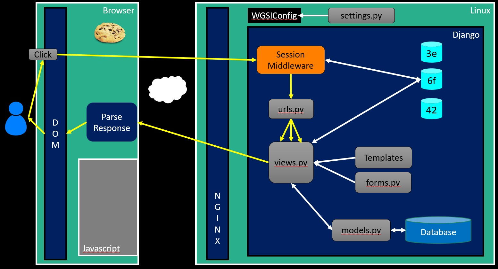
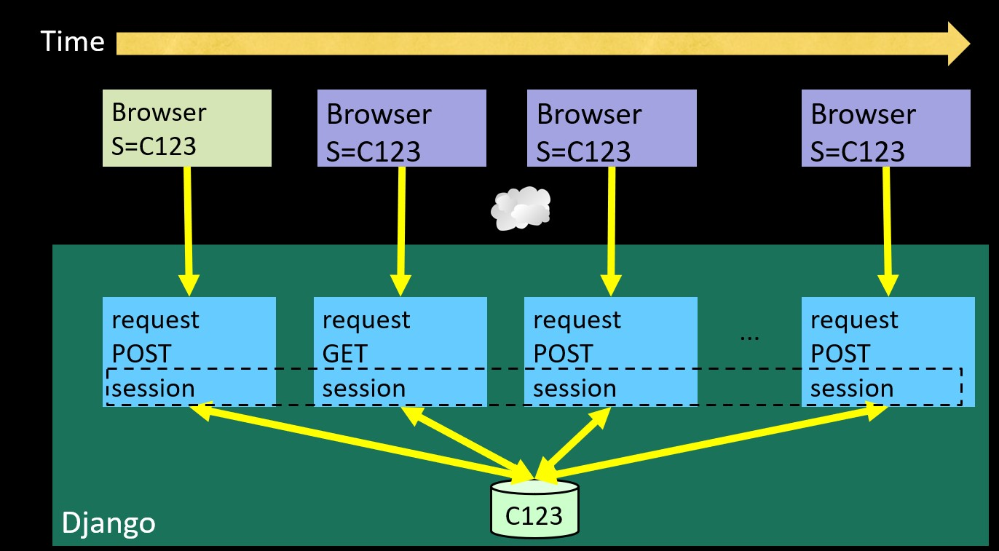
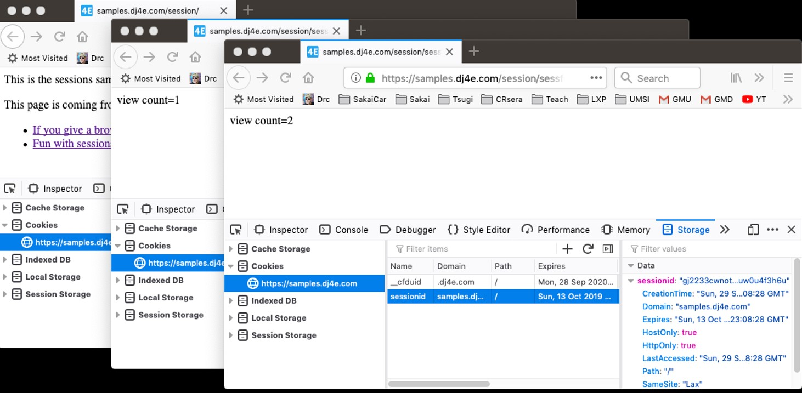

# Index
- [Index](#index)
- [Session](#session)
  - [DJango Session](#django-session)
  - [Session table](#session-table)


# Session

Session are the part on the server where we record thing like this user is log in. 

To work with session in DJango we have a middleware that catches the request even before to get to url.py file. This middleware verify the cookies and look if the session is there then choose if send centain view o anything more.



* In most server applications, as soon as we start a session for a new (unmarked) browser we create a session.
* We set a session cookie to be stored in the browser, which indicates the session id in use – gives this browser a unique “mark”.
* The creation and destruction of sessions is handled by a Django middleware that we use in our applications.

**Session identifier**

* A large, random number that we place in a browser cookie the first time we encounter a browser
* This number is used to pick from the many sessions that the server has active at any one time. 
* Server software stores data in the session that it wants to have from one request to another from the same browser.
* Shopping cart or login information is stored in the session in the server.


This middle ware is activated adding it here:

```python
# https://github.com/csev/dj4e-samples/blob/master/dj4e-samples/settings.py

MIDDLEWARE = [
    'django.middleware.security.SecurityMiddleware',
    'django.contrib.sessions.middleware.SessionMiddleware', # here middleware
    'django.middleware.common.CommonMiddleware',
    'django.middleware.csrf.CsrfViewMiddleware',
    'django.contrib.auth.middleware.AuthenticationMiddleware',
    'django.contrib.messages.middleware.MessageMiddleware',
    'django.middleware.clickjacking.XFrameOptionsMiddleware',
]

```
The session is stored by default in the database and encoded. For this the DJango creates a special table where all sessions are stored and manage autonomous the session information.

```
$ python3 manage.py migrate
Operations to perform:
  Apply all migrations: admin, auth, contenttypes, sessions
Running migrations:
  Applying contenttypes.0001_initial... OK
  Applying auth.0001_initial... OK
  Applying admin.0001_initial... OK
  Applying admin.0002_logentry_remove_auto_add... OK
...
  Applying auth.0009_alter_user_last_name_max_length... OK
  Applying sessions.0001_initial... OK

```
The same session is maintained thorught interaction between server and web broser



## DJango Session

* The incoming request object has a request.session attribute that we can treat like a dictionary that persists from one request to the next request
* As long we have the session middleware enabled in settings.py and the database table, and the browser allows cookies, we just store and read request.session in our views and pretend it is "magic".

So we only have to use a session cookie like a normal dictionary and we use it to save data of the session. Is something that really help to maintain consistency in the interaction with the user.

In the next code the session is used to save how many times the user has visited our web page. This is saved in the session like a dictionary value. The data is saved in the database and the session number is for identify this dictionary.

```python
# https://github.com/csev/dj4e-samples/blob/master/session/views.py

 def sessfun(request) :
     num_visits = request.session.get('num_visits', 0) + 1
     request.session['num_visits'] = num_visits
     if num_visits > 4 : del(request.session['num_visits'])
     return HttpResponse('view count='+str(num_visits))

```
As we can see the cookie only has infomration about the session not the counter. The view send as response the times we viseted the page.



## Session table

If we go to the database we can see the table where the sessions are stored:

```sql
$ sqlite3 db.sqlite3 
SQLite version 3.24.0 2018-06-04 14:10:15
Enter ".help" for usage hints.
sqlite> .tables
auth_group                  auth_user_user_permissions
auth_group_permissions      django_admin_log          
auth_permission             django_content_type       
auth_user                   django_migrations         
auth_user_groups            django_session   

sqlite> .mode column
sqlite> select * from django_session;
vosaoain2dzw0o8bzlgsmovdbkp574us  
    YThiZWRjMjQ1NzZhMzYzMTBhZjYxNWI2ZDgyODI1Y2ExODI2MTJjNzp7Im51bV92aXNpdHMiOjF9  
    2019-02-21 15:18:34.995362
vii016kh2vzqpm0uw3or4qrqxddmwisx  
    OWNkOGQxYjg4NzlkN2ZhOTc2NmU1ODY0NWMzZmQ4YjdhMzM4OTJhNjp7Im51bV92aXNpdHMiOjJ9  
    2019-02-21 15:32:52.555061
sqlite> .quit

```
We can find inside this session rare string the next information. The data is save in base64 because the data will not suffer bad interpretation during transmition. This is some protocol can have a bad interpretation of binary data so is encoded as string text.

```python
$ python3
>>> import base64
>>> import json

>>> x = base64.b64decode(
... 'OWNkOGQxYjg4NzlkN2ZhOTc2NmU1ODY0NWMzZmQ4YjdhMzM4OTJhNjp7Im51bV92aXNpdHMiOjJ9')

>>> print(x)
b'9cd8d1b8879d7fa9766e58645c3fd8b7a33892a6:{"num_visits":2}'

>>> data = json.loads(x[41:])
>>> print(data)
{'num_visits': 2}

```

