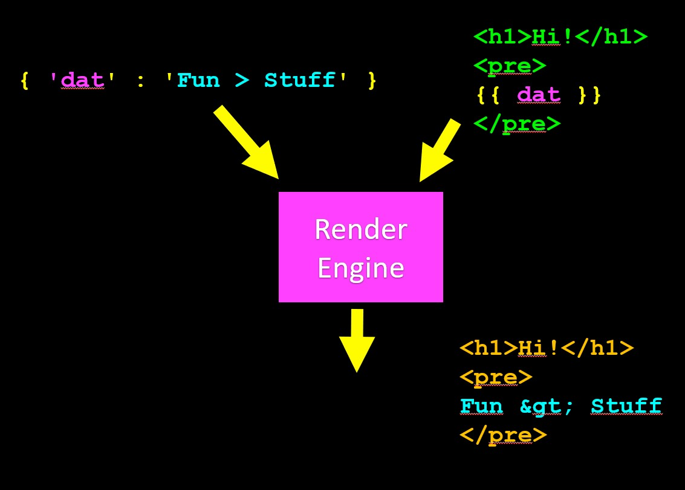
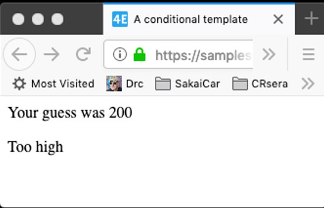

# Index
- [Index](#index)
- [Templates](#templates)
  - [Render engine](#render-engine)
  - [Render example](#render-example)
- [Templates a Deeper Understanding](#templates-a-deeper-understanding)


# Templates
The templates can be look like html but is not hmtl. Is like pre form before we deliver the real html file as response.

> Being a web framework, Django needs a convenient way to generate HTML dynamically. The most common approach relies on templates. A template contains the static parts of the desired HTML output as well as some special syntax describing how dynamic content will be inserted. 
> 
> A Django project can be configured with one or several template engines (or even zero if you don’t use templates). Django ships built-in backends for its own template system, creatively called the Django template language (DTL), and for the popular alternative Jinja2.
> 
> A template is simply a text file. It can generate any text-based format (HTML, XML, CSV, etc.). A template contains variables, which get replaced with values when the template is evaluated, and tags, which control the logic of the template.

[DJango Docs templates](https://docs.djangoproject.com/en/4.0/topics/templates/)

As we can see concat and escaping data is some way too much work and must te be care of python identation, special symbols etc. The alternative to this work is to use templates.

## Render engine

DJango comes with a render engine that recieves the data to use and the template. The tamplate change the special characters int the template for the data we want to show after the result is rendered as html page.



## Render example

The url request has we are passing a value to the `tmpl` application and `game` view.
```
https://samples.dj4e.com/tmpl/game/200

```
We are using a key value pair to passing a value of type `slug`.
```python
path('game/<slug:guess>', views.GameView.as_view())

```
The view (`GameView.get()`) receives the request and the value as parameters then pass the request object, the relative path to the template to use and a dictionary with variables.

```python
from django.shortcuts import render
from django.views import View

class GameView(View) :
    def get(self, request, guess) :
        x = {'guess' : int(guess) }
        return render(request, 'tmpl/cond.html', x)

```

This is the template used. Inside the template is used the curli braces as way to indate the render engine to take action to remplace elements. As you can see this is done with python but not all kind of code just basic to insert values.

```html
<!-- dj4e-samples/tmpl/templates/tmpl/cond.html -->
<html>
<head>
    <title>A conditional template</title>
</head>
<body>
    <p>Your guess was {{ guess }}</p>
    
        <p>Too low</p>
    
        <p>Too high</p>
    
        <p>Just right</p>
    
</body>
</html>

```
In the html we can view a little control flow with if and else sentences. Note this is variation of Python code.


# Templates a Deeper Understanding

We must to we aware that the templates are globally available throught all the project. Becuase when the project is loaded all the template dirs as well. This could be a problem if DJango did't take a convention. This convention is to store the all the templates inside a dir with the same name that the app name.

* It is common to reuse the "**name**" of a template file in several applications
* We use a technique called "**namespace**" so that each application can load its own templates without template name collision

```bash
dj4e-samples$ ls */templates/*/detail.html favs/templates/favs/detail.html
favsql/templates/favsql/detail.html
forums/templates/forums/detail.html
pics/templates/pics/detail.html

dj4e-samples$ 

```

[DJango docs url name spaces](https://docs.djangoproject.com/en/4.0/topics/http/urls/#url-namespaces)

