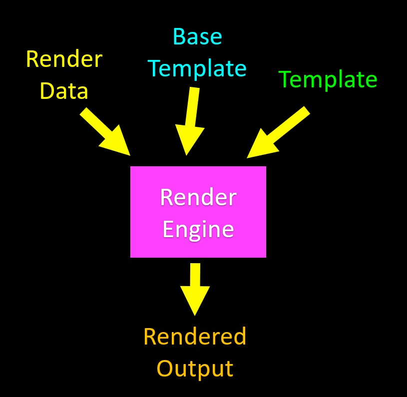

# Index

- [Index](#index)
- [Templates inhiritance](#templates-inhiritance)
  - [Dividing a file](#dividing-a-file)
    - [original file](#original-file)
    - [file divided by hiritance](#file-divided-by-hiritance)


# Templates inhiritance

A part important of templates is inhiritance becuase save us to write tons of code. For example we can have a template with the search menu, head and footer. And only add more specific information with out repeat the other parts in every distict page or app.



## Dividing a file
We normally have something like this but can be splited in two  o more files.

### original file
```html
<!-- tmpl/templates/tmpl/cond.html -->

<html>
<head>
    <title>A conditional template</title>
</head>
<body>
    <p>Your guess was {{ guess }}</p>
    
        <p>Too low</p>
    
        <p>Too high</p>
    
        <p>Just right</p>
    
</body>
</html>
```

### file divided by hiritance

This template class will have all the elements less specific
```html
<!-- tmpl/templates/tmpl/base.html -->

<html>
<head>
    <title>Base template</title>
</head>
<body>
    
</body>
</html>
```
This part will contain the specific parts of the page. 
```html
<!-- tmpl/templates/tmpl/cond2.html -->


  

    <p>Your guess was {{ guess }}</p>
    
        <p>Too low</p>
    
        <p>Too high</p>
    
        <p>Just right</p>
    



```

This two pages will be rendered as one to deliver the final template.
