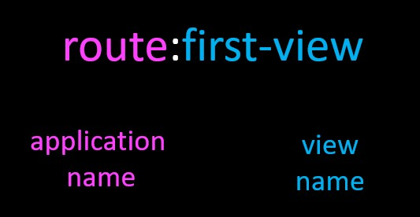
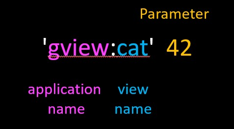

# Index

- [Index](#index)
- [URL Mapping/Reversing](#url-mappingreversing)
- [Navigating between apps](#navigating-between-apps)
- [Second Name Space](#second-name-space)
- [Lazy calling](#lazy-calling)

# URL Mapping/Reversing

This allow us to generate links to one page to another. This is way to avoid to hard code the links of the views. Sometimes is more easy and fast only hardcode the links but with the time is difficult to maintain the project with the corret links.

This is done assinging a pseudo name to the route path then that is used in the templete with a special syntax to create reference to that path. This is useful because now we can change the name the link and use the pseudo name as reference witout broken links

>A common need when working on a Django project is the possibility to obtain URLs in their final forms either for embedding in generated content  or for handling of the navigation flow on the server side (redirections, etc.)
>
>It is strongly desirable to avoid hard-coding these URLs . Equally dangerous is devising ad-hoc mechanisms to generate URLs that are parallel to the design described by the URLconf, which can result in the production of URLs that become stale over time.
>
>In other words, what’s needed is a DRY mechanism. Among other advantages it would allow evolution of the URL design without having to go over all the project source code to search and replace outdated URLs.
>
>The primary piece of information we have available to get a URL is an identification (e.g. the name) of the view in charge of handling it. Other pieces of information that necessarily must participate in the lookup of the right URL are the types (positional, keyword) and values of the view arguments.

[Go to the DJango docs](https://docs.djangoproject.com/en/4.0/topics/http/urls/#reverse-resolution-of-urls)

```python
app_name = 'route'

urlpatterns = [
    path('', TemplateView.as_view(template_name='route/main.html')),
    path('first', views.FirstView.as_view(), name='first-view'),
    path('second', views.SecondView.as_view(), name='second-view'),
]

```

```html
<!-- dj4e-samples/route/templates/route/main.html -->

<li>
    <a href="/route/second">
    hard-coded</a> (not DRY)
</li>
<li>
    
    (url 'route:first-view')
</li>
<li>
    <a href="">
    url 'route:second-view'</a>
</li>

```



# Navigating between apps

With this utility you can easili change between applications without know the specific routes to them. This is done with the same syntax that we use before and even we can pass parameter to them.


```python
# dj4e-samples/gview/urls.py
app_name = 'gview'
urlpatterns = [
    path('cats', views.CatListView.as_view(), name='cats'),
    path('cat/<int:pk_from_url>', views.CatDetailView.as_view(), name='cat'),
]

```
* `` is telling to the template to use `gview` app and the `cats` view without parameters.
* `` is telling to the template the same that previos poitn but also pass a extra parameter `42`.


```html
<!-- dj4e-samples/route/templates/route/main.html -->
 <li>
    
   (url 'gview:cats') from gview/urls.py
</li>
<li>
    
    (url 'gview:cat' 42) from gview/urls.py
</li>

```


Note: You must to aware that this resolve(reverse) the path and put it the html page as complete url. So you need to put with an `<a href=...>` tag or other kind of tag that uses `href` argument.

# Second Name Space

Sometimes is necessary to use a second name space like a way to call (include) by a given name to  url paths  from the main `url.py` file of the project. Remenber that this file is in the same dir with with the project name.

The project name is `dj4e-samples`. Here in this file includes the ubication of the different `url.py` files by app, so we can gives them a second name to acces to them.

```python
# dj4e-samples/dj4e-samples/urls.py

urlpatterns = [
    path('', include('home.urls')), 
    path('admin/', admin.site.urls),  # Keep
    url(r'^oauth/', include('social_django.urls', namespace='social')),
    path('hello/', include('hello.urls')),
    path('route/', include('route.urls', namespace='nsroute')),
]

```

We can use any of two names to enter reference to the view to choose.

```html
<!-- dj4e-samples/route/templates/route/main.html -->

<li>
    <a href="">
      url 'route:second-view'</a>
</li>
          . . . 
<li>
     
    (url 'nsroute:second-view') 
</li>

```

# Lazy calling

Sometimes we want to resolve the path before to go to the template and pass it as string argument. This done with a special function from the module `django.urls`.

```python
# dj4e-samples/route/urls.py

 path('second', views.SecondView.as_view(), name='second-view'),
```

```python
#dj4e-samples/route/views.py

from django.shortcuts import render
from django.urls import reverse
from django.views import View

class SecondView(View):
  def get(self, request) :
    u = reverse('gview:cats')
    u2 = reverse('gview:dogs')
    u3 = reverse('gview:dog', args=['42'] )
    ctx = {'x1' : u, 'x2': u2, 'x3': u3 }
    return render(request, 'route/second.html', ctx)

```

```html
<!-- dj4e-samples/route/templates/route/main.html -->

<li>
    <a href="">
    route:first-view</a>
</li>
<li>
    {{ x1 }} (x1 from context)
</li>
<li>
    {{ x2 }} (x2 from context)
</li>
<li>
    {{ x3 }} (x3 from context)
</li>

```
