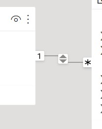
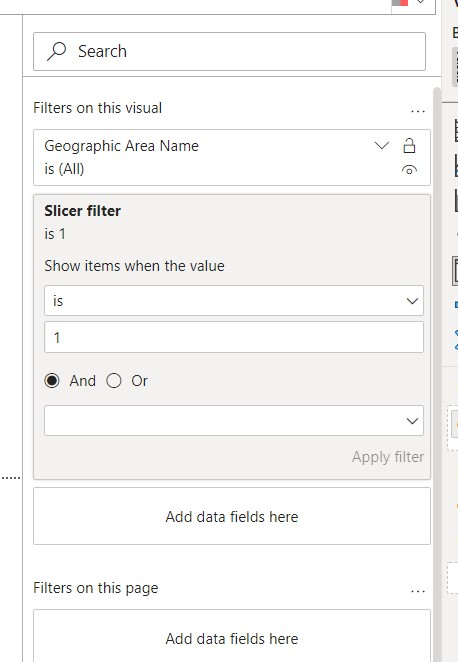
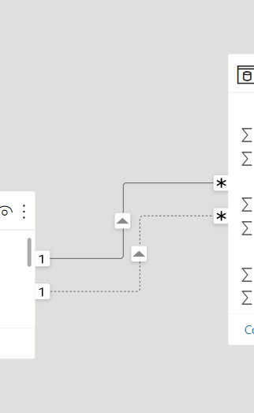
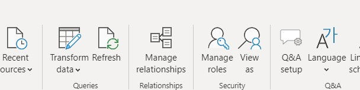
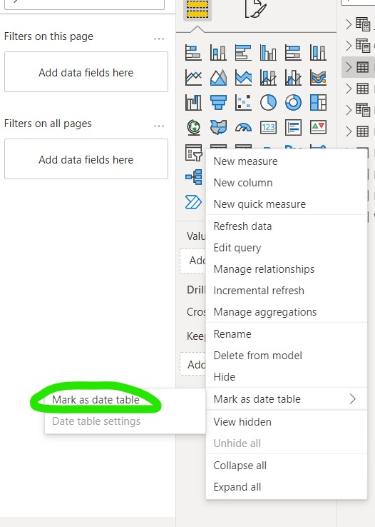

- [1. Key Difference Between Power Query (M language) and DAX](#1-key-difference-between-power-query-m-language-and-dax)
- [2. Power BI General Information](#2-power-bi-general-information)
  - [2.1. Connect data](#21-connect-data)
  - [2.2. About merge key in Power BI](#22-about-merge-key-in-power-bi)
- [3. Power Bi (Dax, Data Analysis eXpressions) Notes](#3-power-bi-dax-data-analysis-expressions-notes)
  - [3.1. DAX context](#31-dax-context)
  - [3.2. Implicit vs Explicit Measures](#32-implicit-vs-explicit-measures)
  - [3.3. Filter contex functions](#33-filter-contex-functions)
    - [3.3.1. CALCULATE a filter expresion](#331-calculate-a-filter-expresion)
    - [3.3.2. FILTER function](#332-filter-function)
    - [3.3.3. Cross Filter](#333-cross-filter)
  - [3.4. Iterative functions](#34-iterative-functions)
    - [3.4.1. RANKX functions](#341-rankx-functions)
  - [3.5. How to create a data time table](#35-how-to-create-a-data-time-table)
    - [3.5.1. How to add more time information with columns...](#351-how-to-add-more-time-information-with-columns)
  - [3.6. Bideretional Relations](#36-bideretional-relations)
  - [3.7. Filter Measures](#37-filter-measures)
  - [3.8. Inactive relations (Role Playing dimentions)](#38-inactive-relations-role-playing-dimentions)
  - [3.9. Row Level-Security (RLS)](#39-row-level-security-rls)
  - [3.10. Manipulation tables](#310-manipulation-tables)
  - [3.11. Time Intelligence Functions](#311-time-intelligence-functions)
- [4. Power Query (M language)](#4-power-query-m-language)
  - [4.1. Replacing multiple characters](#41-replacing-multiple-characters)
- [5. Parameters Power BI](#5-parameters-power-bi)
  - [5.1. Incremental updates](#51-incremental-updates)

# 1. Key Difference Between Power Query (M language) and DAX

Both languages can be fast for small querys, but, for large queries M language is faster. This is because a computed column (M language) are generated at import time, so only is computed one time. Meanwhile, the calculated column (DAX) is computed every with every interaction with a visual.

# 2. Power BI General Information
## 2.1. Connect data
We can connect data of two ways:
* Importing the data to Power BI
* **DirectQuery**

The former charge the data to PowerBI and the latter make a query to a database. In the second is importand only query the relevantdata to the Power BI for performance problemns than can carry this data volume magnitude.

## 2.2. About merge key in Power BI

Power BI only supports **one** columns by merge, so if we have multiple key columns we need to aggregate it to use it as one.


# 3. Power Bi (Dax, Data Analysis eXpressions) Notes

## 3.1. DAX context
The behaviour of DAX calculations changes with the context there are 3 of them:
* Row, 
* Query,
* Filter.

Is crutial to undertant how this context work joinly with DAX. This enables a dynamic analysis based in the  selecction of a set of rows. There a variety of examples like exclude a category with a slicer this will calculate a summarization without that category.

So DAX in:

1. **Row-level** is implicated when we create a calculated column. This values is calculated row by row.
2. **Query-level** are those that are affected by a slicer, a interaction with visual, the implicated values is a subset retrived for a formula and is applied after row context.

3. **FIlter-level** these are values allowed from any column or retrieved from related table. By using argumentes to a formula or by using report filter in a row and columns headings.

## 3.2. Implicit vs Explicit Measures

Is important to know this interaction to understand how to DAX works.

* **Implicit** Is automatically created by Power BI or comes directly from database. The example of this functionality is when we use visual, any visual will apply an implicit function like summarizing with a sum.

* **Explicit** This is all the DAX functions written by the user. This bring a lot of flexibity about the calculations.

There a good practices to work with meaures.
* Maintain the measures grouped, this can be achieved with a new table with all the measures.
* Use a good formatting to write DAX functions and add comments in the complicated parts.
* use another variable (`VAR`) to store intermediate steps when write a complex DAX functions. 
```
//Syntax for declare a variable in a DAX function

VAR
<Name of Var> = <expression>
RETURN  
```
An example would look like this:
```
Cost Growth = 

VAR
CostPriorYear = CALCULATE([Cost], SAMEPERIODLASTYEAR('Date'))
RETURN

// Then using it  in DAX formula

Cost Growth = [Cost] - CostPriorYear
```
## 3.3. Filter contex functions

### 3.3.1. CALCULATE a filter expresion

This function in DAX is very handy, because let you do a lot of things. The function takes an expresion to evaluate and optional filters to select the data under different criteria.
`CALCULATE(<expression>, [<filter1>, <filter2>])`

We can filter data or do more complex things, an example of filtering in a divition is:
```
// function to calculate  % increment to respect previous year

YoY % = 

VAR
salesPreviousYear = CALCULATE([sales], SAMEPERIODLASTYEAR([date]))
RETURN

DIVIDE ([sales] - salesPreviousYear, salesPreviousYear)

```
And this fuction take presedence of any kind of filter so can be used with other functions to avoid to be affected for other filters.

```
quantity not affected by other filter = 
CALCULATE(
    [quantity column], ALL(table)
)
```

**Note:** This interactions can be replicated with the  visual interactions but this is not transparent, with a function is easy to undertand how the values are calculated.

### 3.3.2. FILTER function
This function let us to filter by a especific values or values, syntax:
```
Total quntity = 
CALCULATE(
    [column],
    FILTER(table,
            RELATED(OtherTable[column2] =  "value"))
)
```
Here the `RELATED` function is like to import the value of a column from another table by the use of relation between tables and make a desired comparation. `RELATED` is used with `FILTER`.

### 3.3.3. Cross Filter
Cross filter is used  when we desire one specific direction in the relation. This to avoid to use the default direcion relation between tables (override the default direction).

```
CROSSFILTER (<col1>, <col2>, <direction>)
```

This functin helps to filter data from one dimenctional data to another, by making a double bidirectional relation between the second dimentioanal data to the fact table.

[crossfilter docs](https://docs.microsoft.com/en-us/dax/crossfilter-function)

## 3.4. Iterative functions

This function allows to transform the data by row and avoid to create a column or set of columns toa achieve a calculation. This function usually ends with a X, for example, `SUMX`. 

```
// With out itearative functions
// Create a column
takeaway = FactTable[column1] - FactTable[colunm2]
Total = SUM(FactTable[takeaway])

// With iterative function
Total = 
SUMX(FactTable, FactTable[column1]  FactTable[column2])

```

To control how the interact with the values we use normally a `FILTER` function.

```
SUMX(
    FILTER(
        <table>,
        <filter>
    ),
    <expresion>
)
```
### 3.4.1. RANKX functions

```
RANK(
    <table>,
    <expression>
)

```
This function when is used with a visual is ranked with the visual filtering this can result in weird results as all the rows in a table be 1. This problem can be treated with a filter funtion with RANKX. 

We can use `ALL` to evaluate all the rows, avoiding the visual filtering.

```
NameRankMeasure = 
RANKX(
    ALL(table[columntofilter]),
    [interest column]
)
```


## 3.5. How to create a data time table

For create a date time table to work with, we can do it with DAX commands, this is, create a table with a simple command  only with  start date and end date:
```
DateTable = CALENDAR(DATE(1994), TODAY())
```
This create a table. But if we only want the year, for example, we can do the next:
```
Year = DISTINCT(
    SELECTCOLUMNS(
        CALENDAR(DATE(1994, TODAY()),
        "YEAR", YEAR(Date]))
    )
)
```
This snipped is simple, just create the calendar with all the dates from 1994 to today, consecuently extract the year from column `[Date]` (This column exists because the `CALENDAR` function created it internally), this column is selected with `SELECTCOLUMNS` and renamed to `YEAR`, and finally only gets the non duplicated values with `DISTINCT`.

### 3.5.1. How to add more time information with columns...

In the data view of Power BI we can add more columns (pressing the `Add column` button in the ribbon) to aggregate more information that is relevant to our analysis we can type this in the formula window:

```
"Year"[Year] - MOD ("YEAR"[YEAR], 10)
```
This creates a columns with the **Decade** corresponding to each year. As can you see we can work with numerical expressions.

## 3.6. Bideretional Relations
**Note:** Sometimes this kind of relations can be very inneficient and can be replace with [filter measueres](#filter-measures)

**Note 2:** for security row level is necessary to take other things in consideration [RLS](#row-level-security-rls).

A relation between tables is usually in only one direction but there are circunstances where we can have a bidirectional relation.

The bidirectional relational are useful to filter slicers. When a option doesn't exist in the slicer with this relation we can avoid to show invalid options.

In the schema view in Powe BI we can see this relation like a relation with two arrow like the next image.




## 3.7. Filter Measures

This can be used to reemplace bi-directional relations between tables making our querys more efficient. This works with DAX functions and the goal is to make a dimentional slicer only have relevant data to fact table as the bi-directional table would does.

The trick here is to that the DAX function return 1 if the fact table is not empty for one value in the slicer otherwise return 0:
```
Slicer filter = INT(NOT ISEMPTY('MyFactTable1'))
```
Later this formula is added to the FILTER ribbon of every slicer to show the values only with the option is 1.



**Note:** slicer filter is the name of the mesaure we created.
As we can see this filter measure is used in the filter section of every slicer only showing the values relevant to our fact table. Thats is cool, no?

## 3.8. Inactive relations (Role Playing dimentions)

Usually this mode is achieved with duplicated tables and loops, but, Power Bi is something different. The correct way is achieved with `USERELATION` (a DAX function) the use is described on next.



Power query only allows to use one "active" relation between tables. But sometimes is necessary to have more than one, yeah we can add more, but, these relations are inactive by default. These relations only can be used inside a DAX function and we need to explicitly specify it. This can be very use full in some situations.

```
CustomMeasure = CALCULATE(AVERAGE('TABLE1'[column]),    USERELATION('TABLE1'[column1], 'TABLE2'[column2]))
```

* `CALCULATE` can be used to evalute an expression with a condition or a relation inactive between two columns.
* `USERELATION` is used to represent a inactive relation, the first argumente (qualified column) is the many to  one side and the second argument is the side one to many. If the arguments are changed the function swap it.

With this we can have function that behave different and help us to resolve different business question witout duplicate data.

## 3.9. Row Level-Security (RLS)

Power BI allows to display different information in a visual based in the role of one user. A manager can have total access to the information but regional sales group can only have access to their sales region.

DAX has to function to work these functionalities:
* `USERPRINCIPALNAME()` Return the user principal name (UPN) of the user viewing the report this is the email address.
* `USERNAME()` is a alternative method to enable RLS with his own method use cases.

All this operation are done in the graphic interfaz, you need to go to model view and then to Manage Roles then you craate the roles and add the filters to tables.





**Note:** We need to be carefull because we can find with problems in the relations with tables, for example the visual can have problems to correctly update its values. We need to enable the bidirectinal relation and the security filter option.

## 3.10. Manipulation tables

* [ADDCOLUMN](https://docs.microsoft.com/en-us/dax/addcolumns-function-dax)
* [SUMMARIZE](https://docs.microsoft.com/en-us/dax/summarize-function-dax) this fucntion con be very tricky to work with, because its functinality changes with the context therefore is necessary to wrap it with a columns function. The fucntion always return a table.
```
ADDCOLUMNS(
    SUMMARIZE(<Table1>,
    <group1>,
    <group2>,
    <group...>,
    <groupn>,
    <name>,
    <expression>
    )
)
```
## 3.11. Time Intelligence Functions
This kind of functins allows you to compare data with different time periods.

* `NEXTDAY(<dates>)` return the next day,
* `SAMEPERIODLASTYEAR`  return the same day in the previous year,
* `DATABETWEEN(<Dates>, <Start Date>, <End Date>)` return a set of dates between specified dates.

Is a good practice to create a dimentional table to process data by a data key. This is because the original table has missing values. Missing values can produce weird behaviour.

You can use `CALENDAR` function to create this table and then linked with a fact table.

As well you can mark a table as date table like this:



# 4. Power Query (M language)
## 4.1. Replacing multiple characters

To modify/eliminate multiple character you must first create a list with then. We can be achieved with next formula:


```
Vals2List= Text.ToList("',[]") # Where the character between " symbol are the character to erase.
```

Next we use this list, in special fucntion (`List.Accumulate`) that apply one operation multiple times, in this case apply the erasing character for each elemetn of `Vals2List`, this operation reminds the syntax of anonymous funtion in JAVA or lambda fuctions in Python.

```
= List.Accumulate(Vals2List, #"Removed Other Columns", (table, old)=>Table.ReplaceValue(table,old,"",Replacer.ReplaceText,{"Job Skills"}))
```

Where:
- `Vals2List` is the list created previously with the characters to delete.
- `#"Removed other columns"` is the table to modify, this table can be the result of another operation previously made.
- `table,  old`, these are lambda function variables, and can have any name,
- `{"Job Skills"}` is a list of columns where at least one column must to exist.

The other names/varaibles are function part syntax.

This informatin was take from [here](https://www.youtube.com/watch?v=N-0JrYQB0Ag)

# 5. Parameters Power BI

The parameters allows to change the behaviour of Power BI. The parameters can control things like:
* Filtering
* Inputs  in custom functions
* Changing data source funtions

The parameters are configured in Power Query Editor and the properties that can be set include:
* Name
* Value
* Type

We can have dynamic connections with interchangeable servers and databases. And have incremental refresers.

## 5.1. Incremental updates

Incremental updates has tree part the `archive`, `incremental refresh` and `real time data`. The archive data is only to query historical data, incremental refresh is to update data that could change and real time data is as the name say it. The last option is only for premium Power BI service.

To use incremental updates we need to use the reserved keywords `RangeStart` and `RangeEnd` for the parameters, the parameters has to have date/time type. This can be done in the Power query editor. 

1. Dataset is filtered by `RangeStart` and `RangeEnd`. 
2. Then, the policy is applied to data, archive data is no longer updated, refresh data  is updated along with the real time data.
3. When the refresh time period is reached all the window time is rolled based in time column to ajust what data will be now archive, refreshed and real time get it.
4. `RangeStart` and `RangenEnd` are overriden to ajust the new

More detailed information [here](https://docs.microsoft.com/en-us/power-bi/connect-data/incremental-refresh-overview)
